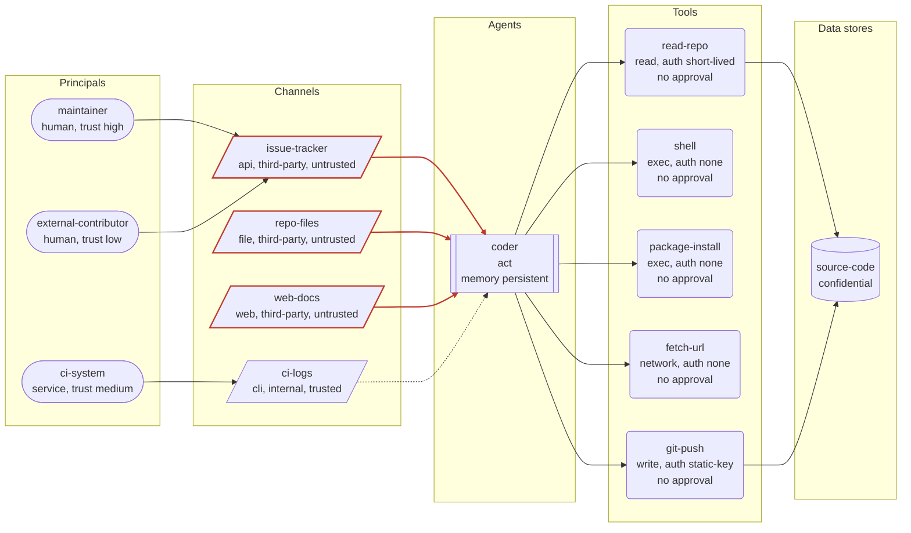

# Threat model: Repository coding agent

Generated by agent-threat-model 0.2.0 from `examples/coding-agent.yaml`. Deterministic output: the same input always produces this report.

Takes issues from the tracker, reads the repository and documentation, runs build and test commands, installs packages and pushes branches.

Owner: developer-productivity team

## Executive summary

22 of the catalogue threats apply to 'Repository coding agent' (0 critical, 9 high, 13 medium, 0 low after mitigations). Residual risk score 89/100 (Critical). The 1 control(s) in place reduce modelled risk by 11% compared with the same system with no controls.

| Severity | Inherent | Residual |
|---|---|---|
| Critical | 1 | 0 |
| High | 14 | 9 |
| Medium | 7 | 13 |
| Low | 0 | 0 |

Top threats after mitigations:

1. **Unsandboxed code or shell execution** (`unsandboxed-exec`), residual 17.7 High: tool 'shell' (exec) runs without a sandbox
1. **Indirect prompt injection via untrusted channel** (`indirect-prompt-injection`), residual 16 High: agent 'coder' reads untrusted channel 'issue-tracker' (api, origin third-party)
1. **Excessive agency on write, exec or payment tools** (`excessive-agency`), residual 14.1 High: agent 'coder' (act) can call tool 'shell' (exec) with approval: none

Highest-leverage missing controls:

- `approval-gates` Human approval for high-impact actions: mitigates 9 applicable threat(s)
- `least-privilege-tool-scopes` Least-privilege scopes on every tool: mitigates 8 applicable threat(s)
- `brokered-credentials` Short-lived, scoped, brokered credentials: mitigates 5 applicable threat(s)
- `argument-validation` Strict schemas for tool arguments: mitigates 4 applicable threat(s)
- `kill-switch` Kill switch with credential revocation: mitigates 4 applicable threat(s)

## System diagram

Dashed edges are trusted channels; solid red edges are untrusted channels (attacker-influenced content reaches the agent).

## System overview

| Element | Id | Details |
|---|---|---|
| Principal | `maintainer` | human, trust high |
| Principal | `external-contributor` | human, trust low |
| Principal | `ci-system` | service, trust medium |
| Agent | `coder` | autonomy act, memory persistent, inputs 4, tools 5 |
| Channel | `issue-tracker` | api, origin third-party, untrusted |
| Channel | `repo-files` | file, origin third-party, untrusted |
| Channel | `web-docs` | web, origin third-party, untrusted |
| Channel | `ci-logs` | cli, origin internal, trusted |
| Tool | `read-repo` | read, auth short-lived, approval none, sandboxed |
| Tool | `shell` | exec, auth none, approval none |
| Tool | `package-install` | exec, auth none, approval none, third-party |
| Tool | `fetch-url` | network, auth none, approval none |
| Tool | `git-push` | write, auth static-key, approval none |
| Data store | `source-code` | confidential |

## Threat register

| # | Threat | STRIDE | OWASP LLM | Inherent | Residual | Affected |
|---|---|---|---|---|---|---|
| 1 | [Unsandboxed code or shell execution](#1-unsandboxed-code-or-shell-execution-unsandboxed-exec) | Elevation of privilege | LLM06, LLM05 | 20 Critical | 17.7 High | `coder`, `package-install`, `shell` |
| 2 | [Indirect prompt injection via untrusted channel](#2-indirect-prompt-injection-via-untrusted-channel-indirect-prompt-injection) | Tampering | LLM01 | 16 High | 16 High | `coder`, `issue-tracker`, `repo-files`, `web-docs` |
| 3 | [Excessive agency on write, exec or payment tools](#3-excessive-agency-on-write-exec-or-payment-tools-excessive-agency) | Elevation of privilege | LLM06 | 16 High | 14.1 High | `coder`, `git-push`, `package-install`, `shell` |
| 4 | [Credential exfiltration through tool call arguments](#4-credential-exfiltration-through-tool-call-arguments-credential-exfiltration-via-tool-args) | Information disclosure | LLM02, LLM01 | 15 High | 13.4 High | `coder`, `fetch-url`, `git-push` |
| 5 | [Denial of wallet](#5-denial-of-wallet-denial-of-wallet) | Denial of service | LLM10 | 12 High | 12 High | `coder`, `fetch-url` |
| 6 | [Low-trust principal drives an autonomous agent](#6-low-trust-principal-drives-an-autonomous-agent-low-trust-principal-drives-agent) | Spoofing | LLM06 | 12 High | 12 High | `coder`, `external-contributor`, `issue-tracker` |
| 7 | [No kill switch or credential revocation](#7-no-kill-switch-or-credential-revocation-missing-kill-switch) | Elevation of privilege | LLM06 | 12 High | 12 High | `coder` |
| 8 | [Over-permissive tool scopes](#8-over-permissive-tool-scopes-over-permissive-scopes) | Elevation of privilege | LLM06 | 12 High | 12 High | `coder`, `git-push`, `shell` |
| 9 | [Tool poisoning via third-party tool descriptions](#9-tool-poisoning-via-third-party-tool-descriptions-tool-poisoning) | Tampering | LLM01, LLM03 | 12 High | 12 High | `coder`, `package-install` |
| 10 | [Persistent memory poisoning](#10-persistent-memory-poisoning-memory-poisoning) | Tampering | LLM01, LLM04 | 12 High | 10.4 Medium | `coder` |
| 11 | [Server-side request forgery through URL-accepting tools](#11-server-side-request-forgery-through-url-accepting-tools-ssrf-via-url-tool) | Information disclosure | LLM06, LLM05 | 12 High | 10.4 Medium | `coder`, `fetch-url` |
| 12 | [Sensitive data reachable by the model](#12-sensitive-data-reachable-by-the-model-sensitive-data-disclosure) | Information disclosure | LLM02 | 12 High | 10.2 Medium | `coder`, `git-push`, `read-repo`, `source-code` |
| 13 | [Destructive actions through write tools](#13-destructive-actions-through-write-tools-destructive-write-actions) | Tampering | LLM06, LLM01 | 12 High | 10.1 Medium | `coder`, `git-push`, `issue-tracker`, `repo-files`, `web-docs` |
| 14 | [Static long-lived credentials held by the agent](#14-static-long-lived-credentials-held-by-the-agent-static-long-lived-credentials) | Information disclosure | LLM02 | 12 High | 10.1 Medium | `coder`, `git-push` |
| 15 | [Side-effecting tool with no authentication](#15-side-effecting-tool-with-no-authentication-unauthenticated-tool) | Spoofing | LLM06 | 12 High | 9.8 Medium | `coder`, `fetch-url`, `package-install`, `shell` |
| 16 | [Acting on hallucinated facts or identifiers](#16-acting-on-hallucinated-facts-or-identifiers-hallucinated-actions) | Tampering | LLM09, LLM06 | 9 Medium | 9 Medium | `coder`, `git-push`, `package-install`, `shell` |
| 17 | [Model output consumed without validation](#17-model-output-consumed-without-validation-insecure-output-handling) | Tampering | LLM05 | 9 Medium | 9 Medium | `coder`, `git-push`, `package-install`, `shell`, `web-docs` |
| 18 | [Malicious files and documents as input](#18-malicious-files-and-documents-as-input-malicious-file-input) | Tampering | LLM01 | 9 Medium | 9 Medium | `coder`, `repo-files` |
| 19 | [No rate limits on tool calls](#19-no-rate-limits-on-tool-calls-no-rate-limits) | Denial of service | LLM10 | 9 Medium | 9 Medium | `coder` |
| 20 | [Unpinned model or tool versions](#20-unpinned-model-or-tool-versions-supply-chain-unpinned) | Tampering | LLM03 | 8 Medium | 8 Medium | `coder`, `fetch-url`, `git-push`, `package-install`, `read-repo`, `shell` |
| 21 | [System prompt and configuration leakage](#21-system-prompt-and-configuration-leakage-system-prompt-leakage) | Information disclosure | LLM07 | 8 Medium | 8 Medium | `coder`, `issue-tracker`, `repo-files`, `web-docs` |
| 22 | [Agent configuration tampering](#22-agent-configuration-tampering-agent-config-tampering) | Tampering | LLM03, LLM06 | 8 Medium | 6.9 Medium | `coder`, `git-push`, `package-install`, `shell` |

### 1. Unsandboxed code or shell execution (`unsandboxed-exec`)

An exec tool runs model-chosen commands on a host that holds credentials, source code or network access. Any injection or mistake becomes arbitrary code execution with the host's privileges.

| Field | Value |
|---|---|
| STRIDE | Elevation of privilege |
| OWASP LLM Top 10 (2025) | LLM06 Excessive Agency, LLM05 Improper Output Handling |
| OWASP Agentic Top 10 (2026) | ASI05 Unexpected Code Execution |
| MITRE ATLAS | [AML.T0050](https://atlas.mitre.org/techniques/AML.T0050), [AML.T0105](https://atlas.mitre.org/techniques/AML.T0105), [AML.T0072](https://atlas.mitre.org/techniques/AML.T0072) |
| Inherent severity | 20 (Critical): likelihood 4 x impact 5 |
| Residual severity | 17.7 (High), mitigation coverage 15% |
| Affected elements | `coder`, `package-install`, `shell` |
| Rule | `tool_kind_not_sandboxed(kinds=exec)` |

Why it applies:

- tool 'shell' (exec) runs without a sandbox
- tool 'package-install' (exec) runs without a sandbox

Mitigations:

- [x] `audit-log` Tamper-evident audit log of every tool call
- [ ] `sandboxed-execution` Run code and shell tools in an ephemeral sandbox
- [ ] `approval-gates` Human approval for high-impact actions
- [ ] `egress-allowlist` Allowlist network egress and message recipients
- [ ] `kill-switch` Kill switch with credential revocation

### 2. Indirect prompt injection via untrusted channel (`indirect-prompt-injection`)

Content the agent reads from an untrusted channel (email, web pages, documents, retrieved passages, API responses) carries instructions that the model follows as if they came from the operator. Every tool the agent can reach becomes available to whoever wrote that content.

| Field | Value |
|---|---|
| STRIDE | Tampering |
| OWASP LLM Top 10 (2025) | LLM01 Prompt Injection |
| OWASP Agentic Top 10 (2026) | ASI01 Agent Goal Hijack |
| MITRE ATLAS | [AML.T0051.001](https://atlas.mitre.org/techniques/AML.T0051.001) |
| Inherent severity | 16 (High): likelihood 4 x impact 4 |
| Residual severity | 16 (High), mitigation coverage 0% |
| Affected elements | `coder`, `issue-tracker`, `repo-files`, `web-docs` |
| Rule | `untrusted_channel_in_agent_inputs` |

Why it applies:

- agent 'coder' reads untrusted channel 'issue-tracker' (api, origin third-party)
- agent 'coder' reads untrusted channel 'repo-files' (file, origin third-party)
- agent 'coder' reads untrusted channel 'web-docs' (web, origin third-party)

Mitigations:

- [ ] `input-provenance-tagging` Tag every input with its provenance and trust level
- [ ] `untrusted-content-isolation` Isolate untrusted content from the privileged agent
- [ ] `prompt-injection-filtering` Detect injection attempts in untrusted content
- [ ] `least-privilege-tool-scopes` Least-privilege scopes on every tool
- [ ] `approval-gates` Human approval for high-impact actions

References:

- <https://github.com/OWASP/www-project-top-10-for-large-language-model-applications/blob/main/2_0_vulns/LLM01_PromptInjection.md>

### 3. Excessive agency on write, exec or payment tools (`excessive-agency`)

An agent that may act on its own can call a tool with side effects without any approval step. One wrong inference, one injected instruction or one hallucinated argument becomes a real-world action.

| Field | Value |
|---|---|
| STRIDE | Elevation of privilege |
| OWASP LLM Top 10 (2025) | LLM06 Excessive Agency |
| OWASP Agentic Top 10 (2026) | ASI02 Tool Misuse and Exploitation, ASI03 Identity and Privilege Abuse |
| MITRE ATLAS | [AML.T0053](https://atlas.mitre.org/techniques/AML.T0053) |
| Inherent severity | 16 (High): likelihood 4 x impact 4 |
| Residual severity | 14.1 (High), mitigation coverage 15% |
| Affected elements | `coder`, `git-push`, `package-install`, `shell` |
| Rule | `tool_kind_without_approval(kinds=write|exec|payment)` |

Why it applies:

- agent 'coder' (act) can call tool 'shell' (exec) with approval: none
- agent 'coder' (act) can call tool 'package-install' (exec) with approval: none
- agent 'coder' (act) can call tool 'git-push' (write) with approval: none

Mitigations:

- [x] `audit-log` Tamper-evident audit log of every tool call
- [ ] `approval-gates` Human approval for high-impact actions
- [ ] `runtime-policy-enforcement` Enforce policy outside the model
- [ ] `least-privilege-tool-scopes` Least-privilege scopes on every tool
- [ ] `kill-switch` Kill switch with credential revocation

References:

- <https://github.com/OWASP/www-project-top-10-for-large-language-model-applications/blob/main/2_0_vulns/LLM06_ExcessiveAgency.md>

### 4. Credential exfiltration through tool call arguments (`credential-exfiltration-via-tool-args`)

A tool holds a static key that is visible to the model (in configuration, descriptions or memory) and another tool can send data outward. An injected instruction asks the model to place the secret into a URL, message body or file that leaves the system.

| Field | Value |
|---|---|
| STRIDE | Information disclosure |
| OWASP LLM Top 10 (2025) | LLM02 Sensitive Information Disclosure, LLM01 Prompt Injection |
| OWASP Agentic Top 10 (2026) | ASI02 Tool Misuse and Exploitation, ASI03 Identity and Privilege Abuse |
| MITRE ATLAS | [AML.T0098](https://atlas.mitre.org/techniques/AML.T0098), [AML.T0086](https://atlas.mitre.org/techniques/AML.T0086), [AML.T0083](https://atlas.mitre.org/techniques/AML.T0083) |
| Inherent severity | 15 (High): likelihood 3 x impact 5 |
| Residual severity | 13.4 (High), mitigation coverage 13% |
| Affected elements | `coder`, `fetch-url`, `git-push` |
| Rule | `all(tool_auth_in(auth=static-key), agent_has_tool_kind(kinds=network|messaging|write))` |

Why it applies:

- tool 'git-push' (write) uses auth: static-key
- agent 'coder' can call tool 'fetch-url' (network)
- agent 'coder' can call tool 'git-push' (write)

Mitigations:

- [x] `audit-log` Tamper-evident audit log of every tool call
- [ ] `secrets-out-of-context` Keep secrets out of the model context
- [ ] `brokered-credentials` Short-lived, scoped, brokered credentials
- [ ] `egress-allowlist` Allowlist network egress and message recipients
- [ ] `argument-validation` Strict schemas for tool arguments

### 5. Denial of wallet (`denial-of-wallet`)

The agent can spend money or paid API quota and nothing caps the amount per task. A loop, an injection or a malicious user turns the agent into a bill.

| Field | Value |
|---|---|
| STRIDE | Denial of service |
| OWASP LLM Top 10 (2025) | LLM10 Unbounded Consumption |
| OWASP Agentic Top 10 (2026) | ASI08 Cascading Agent Failures |
| MITRE ATLAS | [AML.T0034.002](https://atlas.mitre.org/techniques/AML.T0034.002), [AML.T0034](https://atlas.mitre.org/techniques/AML.T0034) |
| Inherent severity | 12 (High): likelihood 3 x impact 4 |
| Residual severity | 12 (High), mitigation coverage 0% |
| Affected elements | `coder`, `fetch-url` |
| Rule | `all(control_missing(control=budget-caps), any(agent_has_tool_kind(kinds=payment|network), agent_autonomy_in(autonomy=act)))` |

Why it applies:

- control 'budget-caps' is not in place
- agent 'coder' can call tool 'fetch-url' (network)
- agent 'coder' has autonomy act

Mitigations:

- [ ] `budget-caps` Hard budget caps on spend and tokens
- [ ] `rate-limiting` Rate limits on tool calls and iterations
- [ ] `approval-gates` Human approval for high-impact actions
- [ ] `behavioural-monitoring` Monitor agent behaviour for anomalies

References:

- <https://github.com/OWASP/www-project-top-10-for-large-language-model-applications/blob/main/2_0_vulns/LLM10_UnboundedConsumption.md>

### 6. Low-trust principal drives an autonomous agent (`low-trust-principal-drives-agent`)

A principal the operator does not trust (anonymous users, external partners) can send instructions to an agent that acts without approval. The agent's tools are effectively exposed to the public.

| Field | Value |
|---|---|
| STRIDE | Spoofing |
| OWASP LLM Top 10 (2025) | LLM06 Excessive Agency |
| OWASP Agentic Top 10 (2026) | ASI01 Agent Goal Hijack, ASI03 Identity and Privilege Abuse |
| MITRE ATLAS | [AML.T0053](https://atlas.mitre.org/techniques/AML.T0053) |
| Inherent severity | 12 (High): likelihood 3 x impact 4 |
| Residual severity | 12 (High), mitigation coverage 0% |
| Affected elements | `coder`, `external-contributor`, `issue-tracker` |
| Rule | `all(low_trust_principal_feeds_agent, agent_autonomy_in(autonomy=act))` |

Why it applies:

- low-trust principal 'external-contributor' reaches agent 'coder' through channel 'issue-tracker'
- agent 'coder' has autonomy act

Mitigations:

- [ ] `approval-gates` Human approval for high-impact actions
- [ ] `agent-identity` Authenticated identities for agents and principals
- [ ] `least-privilege-tool-scopes` Least-privilege scopes on every tool
- [ ] `rate-limiting` Rate limits on tool calls and iterations

### 7. No kill switch or credential revocation (`missing-kill-switch`)

An agent that acts in the world cannot be stopped quickly. When behaviour goes wrong the only options are to find the process and the keys by hand while actions keep happening.

| Field | Value |
|---|---|
| STRIDE | Elevation of privilege |
| OWASP LLM Top 10 (2025) | LLM06 Excessive Agency |
| OWASP Agentic Top 10 (2026) | ASI10 Rogue Agents, ASI08 Cascading Agent Failures |
| MITRE ATLAS | - |
| Inherent severity | 12 (High): likelihood 3 x impact 4 |
| Residual severity | 12 (High), mitigation coverage 0% |
| Affected elements | `coder` |
| Rule | `all(control_missing(control=kill-switch), agent_autonomy_in(autonomy=act|act-with-approval))` |

Why it applies:

- control 'kill-switch' is not in place
- agent 'coder' has autonomy act

Mitigations:

- [ ] `kill-switch` Kill switch with credential revocation
- [ ] `brokered-credentials` Short-lived, scoped, brokered credentials
- [ ] `incident-response-playbook` Incident response playbook for agent incidents

### 8. Over-permissive tool scopes (`over-permissive-scopes`)

A tool is granted wildcard, admin or undeclared scope. Whatever goes wrong, the blast radius is the whole account rather than the one resource the task needed.

| Field | Value |
|---|---|
| STRIDE | Elevation of privilege |
| OWASP LLM Top 10 (2025) | LLM06 Excessive Agency |
| OWASP Agentic Top 10 (2026) | ASI03 Identity and Privilege Abuse |
| MITRE ATLAS | [AML.T0053](https://atlas.mitre.org/techniques/AML.T0053) |
| Inherent severity | 12 (High): likelihood 3 x impact 4 |
| Residual severity | 12 (High), mitigation coverage 0% |
| Affected elements | `coder`, `git-push`, `shell` |
| Rule | `tool_scope_broad` |

Why it applies:

- tool 'shell' (exec) has a broad scope: run any command in the checkout
- tool 'git-push' (write) has a broad scope: push to any branch of the repository

Mitigations:

- [ ] `least-privilege-tool-scopes` Least-privilege scopes on every tool
- [ ] `brokered-credentials` Short-lived, scoped, brokered credentials
- [ ] `approval-gates` Human approval for high-impact actions

### 9. Tool poisoning via third-party tool descriptions (`tool-poisoning`)

A third-party tool or tool server ships descriptions, schemas or results that contain hidden instructions. The model reads them as trusted configuration and can be steered to leak data or call other tools.

| Field | Value |
|---|---|
| STRIDE | Tampering |
| OWASP LLM Top 10 (2025) | LLM01 Prompt Injection, LLM03 Supply Chain |
| OWASP Agentic Top 10 (2026) | ASI04 Agentic Supply Chain Vulnerabilities, ASI01 Agent Goal Hijack |
| MITRE ATLAS | [AML.T0110](https://atlas.mitre.org/techniques/AML.T0110), [AML.T0104](https://atlas.mitre.org/techniques/AML.T0104), [AML.T0099](https://atlas.mitre.org/techniques/AML.T0099) |
| Inherent severity | 12 (High): likelihood 3 x impact 4 |
| Residual severity | 12 (High), mitigation coverage 0% |
| Affected elements | `coder`, `package-install` |
| Rule | `third_party_tool` |

Why it applies:

- tool 'package-install' (exec) and its description come from a third party

Mitigations:

- [ ] `tool-integrity-pinning` Pin tool versions and hash tool descriptions
- [ ] `input-provenance-tagging` Tag every input with its provenance and trust level
- [ ] `least-privilege-tool-scopes` Least-privilege scopes on every tool
- [ ] `approval-gates` Human approval for high-impact actions

References:

- <https://modelcontextprotocol.io/specification/2025-06-18/basic/security_best_practices>

### 10. Persistent memory poisoning (`memory-poisoning`)

The agent writes what it learns into long-term memory. Content from one interaction (possibly injected) is stored and later retrieved as trusted context, so a single poisoned message steers every future session.

| Field | Value |
|---|---|
| STRIDE | Tampering |
| OWASP LLM Top 10 (2025) | LLM01 Prompt Injection, LLM04 Data and Model Poisoning |
| OWASP Agentic Top 10 (2026) | ASI06 Memory and Context Poisoning |
| MITRE ATLAS | [AML.T0080.000](https://atlas.mitre.org/techniques/AML.T0080.000) |
| Inherent severity | 12 (High): likelihood 3 x impact 4 |
| Residual severity | 10.4 (Medium), mitigation coverage 17% |
| Affected elements | `coder` |
| Rule | `agent_memory_is(memory=persistent)` |

Why it applies:

- agent 'coder' keeps persistent memory

Mitigations:

- [x] `audit-log` Tamper-evident audit log of every tool call
- [ ] `memory-write-validation` Validate and expire writes to persistent memory
- [ ] `session-isolation` Isolate memory and context per user and session
- [ ] `input-provenance-tagging` Tag every input with its provenance and trust level

### 11. Server-side request forgery through URL-accepting tools (`ssrf-via-url-tool`)

A tool fetches URLs chosen by the model. Attacker-influenced input makes it request internal services, cloud metadata endpoints or private address ranges, and the response flows back into the context.

| Field | Value |
|---|---|
| STRIDE | Information disclosure |
| OWASP LLM Top 10 (2025) | LLM06 Excessive Agency, LLM05 Improper Output Handling |
| OWASP Agentic Top 10 (2026) | ASI02 Tool Misuse and Exploitation |
| MITRE ATLAS | [AML.T0053](https://atlas.mitre.org/techniques/AML.T0053) |
| Inherent severity | 12 (High): likelihood 3 x impact 4 |
| Residual severity | 10.4 (Medium), mitigation coverage 17% |
| Affected elements | `coder`, `fetch-url` |
| Rule | `agent_has_tool_kind(kinds=network)` |

Why it applies:

- agent 'coder' can call tool 'fetch-url' (network)

Mitigations:

- [x] `audit-log` Tamper-evident audit log of every tool call
- [ ] `egress-allowlist` Allowlist network egress and message recipients
- [ ] `argument-validation` Strict schemas for tool arguments
- [ ] `sandboxed-execution` Run code and shell tools in an ephemeral sandbox

References:

- <https://cheatsheetseries.owasp.org/cheatsheets/Server_Side_Request_Forgery_Prevention_Cheat_Sheet.html>

### 12. Sensitive data reachable by the model (`sensitive-data-disclosure`)

The agent can read confidential or regulated records through a tool. Whatever enters the context can be summarised, quoted or exfiltrated, and a shared service account returns records the requesting user may not be entitled to.

| Field | Value |
|---|---|
| STRIDE | Information disclosure |
| OWASP LLM Top 10 (2025) | LLM02 Sensitive Information Disclosure |
| OWASP Agentic Top 10 (2026) | ASI03 Identity and Privilege Abuse, ASI02 Tool Misuse and Exploitation |
| MITRE ATLAS | [AML.T0057](https://atlas.mitre.org/techniques/AML.T0057), [AML.T0085.000](https://atlas.mitre.org/techniques/AML.T0085.000), [AML.T0036](https://atlas.mitre.org/techniques/AML.T0036) |
| Inherent severity | 12 (High): likelihood 3 x impact 4 |
| Residual severity | 10.2 (Medium), mitigation coverage 19% |
| Affected elements | `coder`, `git-push`, `read-repo`, `source-code` |
| Rule | `agent_reaches_sensitive_store(min=confidential)` |

Why it applies:

- agent 'coder' reaches confidential store 'source-code' through tool 'read-repo' (read)
- agent 'coder' reaches confidential store 'source-code' through tool 'git-push' (write)

Mitigations:

- [x] `audit-log` Tamper-evident audit log of every tool call
- [ ] `per-user-authorisation` Access data with the end user's permissions
- [ ] `least-privilege-tool-scopes` Least-privilege scopes on every tool
- [ ] `dlp-outbound` Data loss prevention on outbound messages

References:

- <https://github.com/OWASP/www-project-top-10-for-large-language-model-applications/blob/main/2_0_vulns/LLM02_SensitiveInformationDisclosure.md>

### 13. Destructive actions through write tools (`destructive-write-actions`)

The agent can modify or delete data and reads untrusted content. An injected instruction (or a plain mistake) deletes records, overwrites files or force-pushes over history.

| Field | Value |
|---|---|
| STRIDE | Tampering |
| OWASP LLM Top 10 (2025) | LLM06 Excessive Agency, LLM01 Prompt Injection |
| OWASP Agentic Top 10 (2026) | ASI02 Tool Misuse and Exploitation |
| MITRE ATLAS | [AML.T0101](https://atlas.mitre.org/techniques/AML.T0101) |
| Inherent severity | 12 (High): likelihood 3 x impact 4 |
| Residual severity | 10.1 (Medium), mitigation coverage 19% |
| Affected elements | `coder`, `git-push`, `issue-tracker`, `repo-files`, `web-docs` |
| Rule | `all(agent_has_tool_kind(kinds=write), untrusted_channel_in_agent_inputs)` |

Why it applies:

- agent 'coder' can call tool 'git-push' (write)
- agent 'coder' reads untrusted channel 'issue-tracker' (api, origin third-party)
- agent 'coder' reads untrusted channel 'repo-files' (file, origin third-party)
- agent 'coder' reads untrusted channel 'web-docs' (web, origin third-party)

Mitigations:

- [x] `audit-log` Tamper-evident audit log of every tool call
- [ ] `approval-gates` Human approval for high-impact actions
- [ ] `backups-and-rollback` Backups and rollback for agent-writable data
- [ ] `least-privilege-tool-scopes` Least-privilege scopes on every tool

### 14. Static long-lived credentials held by the agent (`static-long-lived-credentials`)

Tools authenticate with static keys that do not expire. If a key leaks through logs, prompts or an injected exfiltration it remains valid until someone notices, and it cannot be scoped to a single task.

| Field | Value |
|---|---|
| STRIDE | Information disclosure |
| OWASP LLM Top 10 (2025) | LLM02 Sensitive Information Disclosure |
| OWASP Agentic Top 10 (2026) | ASI03 Identity and Privilege Abuse |
| MITRE ATLAS | [AML.T0055](https://atlas.mitre.org/techniques/AML.T0055), [AML.T0083](https://atlas.mitre.org/techniques/AML.T0083) |
| Inherent severity | 12 (High): likelihood 3 x impact 4 |
| Residual severity | 10.1 (Medium), mitigation coverage 19% |
| Affected elements | `coder`, `git-push` |
| Rule | `tool_auth_in(auth=static-key)` |

Why it applies:

- tool 'git-push' (write) uses auth: static-key

Mitigations:

- [x] `audit-log` Tamper-evident audit log of every tool call
- [ ] `brokered-credentials` Short-lived, scoped, brokered credentials
- [ ] `secrets-out-of-context` Keep secrets out of the model context
- [ ] `kill-switch` Kill switch with credential revocation

### 15. Side-effecting tool with no authentication (`unauthenticated-tool`)

A tool that writes, executes, pays, sends or fetches requires no authentication at all. Calls cannot be attributed to an agent or principal, and anything that can reach the endpoint can use it.

| Field | Value |
|---|---|
| STRIDE | Spoofing |
| OWASP LLM Top 10 (2025) | LLM06 Excessive Agency |
| OWASP Agentic Top 10 (2026) | ASI03 Identity and Privilege Abuse |
| MITRE ATLAS | [AML.T0053](https://atlas.mitre.org/techniques/AML.T0053) |
| Inherent severity | 12 (High): likelihood 3 x impact 4 |
| Residual severity | 9.8 (Medium), mitigation coverage 23% |
| Affected elements | `coder`, `fetch-url`, `package-install`, `shell` |
| Rule | `tool_auth_in(auth=none, kinds=write|exec|payment|messaging|network)` |

Why it applies:

- tool 'shell' (exec) uses auth: none
- tool 'package-install' (exec) uses auth: none
- tool 'fetch-url' (network) uses auth: none

Mitigations:

- [x] `audit-log` Tamper-evident audit log of every tool call
- [ ] `agent-identity` Authenticated identities for agents and principals
- [ ] `brokered-credentials` Short-lived, scoped, brokered credentials

### 16. Acting on hallucinated facts or identifiers (`hallucinated-actions`)

The agent invents a package name, account id, file path or amount and a side-effecting tool executes it. Attackers register the names models tend to invent so the mistake resolves to something malicious.

| Field | Value |
|---|---|
| STRIDE | Tampering |
| OWASP LLM Top 10 (2025) | LLM09 Misinformation, LLM06 Excessive Agency |
| OWASP Agentic Top 10 (2026) | ASI02 Tool Misuse and Exploitation, ASI04 Agentic Supply Chain Vulnerabilities |
| MITRE ATLAS | [AML.T0060](https://atlas.mitre.org/techniques/AML.T0060), [AML.T0053](https://atlas.mitre.org/techniques/AML.T0053) |
| Inherent severity | 9 (Medium): likelihood 3 x impact 3 |
| Residual severity | 9 (Medium), mitigation coverage 0% |
| Affected elements | `coder`, `git-push`, `package-install`, `shell` |
| Rule | `all(agent_autonomy_in(autonomy=act|act-with-approval), agent_has_tool_kind(kinds=exec|write|payment))` |

Why it applies:

- agent 'coder' has autonomy act
- agent 'coder' can call tool 'shell' (exec)
- agent 'coder' can call tool 'package-install' (exec)
- agent 'coder' can call tool 'git-push' (write)

Mitigations:

- [ ] `argument-validation` Strict schemas for tool arguments
- [ ] `approval-gates` Human approval for high-impact actions
- [ ] `tool-integrity-pinning` Pin tool versions and hash tool descriptions
- [ ] `adversarial-testing` Adversarial testing before and after release

References:

- <https://arxiv.org/abs/2406.10279>

### 17. Model output consumed without validation (`insecure-output-handling`)

Downstream components render model output in a browser, pass it to a shell or database, or execute it. Injected or malformed output becomes cross-site scripting, command injection or unintended writes.

| Field | Value |
|---|---|
| STRIDE | Tampering |
| OWASP LLM Top 10 (2025) | LLM05 Improper Output Handling |
| OWASP Agentic Top 10 (2026) | ASI05 Unexpected Code Execution |
| MITRE ATLAS | [AML.T0077](https://atlas.mitre.org/techniques/AML.T0077), [AML.T0067](https://atlas.mitre.org/techniques/AML.T0067) |
| Inherent severity | 9 (Medium): likelihood 3 x impact 3 |
| Residual severity | 9 (Medium), mitigation coverage 0% |
| Affected elements | `coder`, `git-push`, `package-install`, `shell`, `web-docs` |
| Rule | `any(agent_has_tool_kind(kinds=exec|write), agent_has_channel_kind(kinds=web))` |

Why it applies:

- agent 'coder' can call tool 'shell' (exec)
- agent 'coder' can call tool 'package-install' (exec)
- agent 'coder' can call tool 'git-push' (write)
- agent 'coder' reads untrusted web channel 'web-docs'

Mitigations:

- [ ] `output-encoding` Treat model output as untrusted data downstream
- [ ] `argument-validation` Strict schemas for tool arguments
- [ ] `sandboxed-execution` Run code and shell tools in an ephemeral sandbox

References:

- <https://github.com/OWASP/www-project-top-10-for-large-language-model-applications/blob/main/2_0_vulns/LLM05_ImproperOutputHandling.md>

### 18. Malicious files and documents as input (`malicious-file-input`)

The agent parses files or documents. Crafted files exploit parser bugs, hide instructions in metadata or invisible text, and carry macros or links that later tools act on.

| Field | Value |
|---|---|
| STRIDE | Tampering |
| OWASP LLM Top 10 (2025) | LLM01 Prompt Injection |
| OWASP Agentic Top 10 (2026) | ASI01 Agent Goal Hijack |
| MITRE ATLAS | [AML.T0051.001](https://atlas.mitre.org/techniques/AML.T0051.001), [AML.T0011.000](https://atlas.mitre.org/techniques/AML.T0011.000) |
| Inherent severity | 9 (Medium): likelihood 3 x impact 3 |
| Residual severity | 9 (Medium), mitigation coverage 0% |
| Affected elements | `coder`, `repo-files` |
| Rule | `agent_has_channel_kind(kinds=file|document, untrusted=true)` |

Why it applies:

- agent 'coder' reads untrusted file channel 'repo-files'

Mitigations:

- [ ] `untrusted-content-isolation` Isolate untrusted content from the privileged agent
- [ ] `sandboxed-execution` Run code and shell tools in an ephemeral sandbox
- [ ] `prompt-injection-filtering` Detect injection attempts in untrusted content
- [ ] `input-provenance-tagging` Tag every input with its provenance and trust level

### 19. No rate limits on tool calls (`no-rate-limits`)

Nothing bounds how many tool calls or loop iterations an agent may make. A runaway loop or an attacker-driven burst exhausts quotas, floods downstream systems and amplifies every other threat.

| Field | Value |
|---|---|
| STRIDE | Denial of service |
| OWASP LLM Top 10 (2025) | LLM10 Unbounded Consumption |
| OWASP Agentic Top 10 (2026) | ASI08 Cascading Agent Failures |
| MITRE ATLAS | [AML.T0029](https://atlas.mitre.org/techniques/AML.T0029), [AML.T0034](https://atlas.mitre.org/techniques/AML.T0034) |
| Inherent severity | 9 (Medium): likelihood 3 x impact 3 |
| Residual severity | 9 (Medium), mitigation coverage 0% |
| Affected elements | `coder` |
| Rule | `all(control_missing(control=rate-limiting), agent_has_any_tool)` |

Why it applies:

- control 'rate-limiting' is not in place
- agent 'coder' can call 5 tool(s)

Mitigations:

- [ ] `rate-limiting` Rate limits on tool calls and iterations
- [ ] `budget-caps` Hard budget caps on spend and tokens
- [ ] `behavioural-monitoring` Monitor agent behaviour for anomalies

### 20. Unpinned model or tool versions (`supply-chain-unpinned`)

The model version, tool packages or tool servers are not pinned. A silent upstream change (or a deliberate rug pull) alters behaviour and permissions without any review.

| Field | Value |
|---|---|
| STRIDE | Tampering |
| OWASP LLM Top 10 (2025) | LLM03 Supply Chain |
| OWASP Agentic Top 10 (2026) | ASI04 Agentic Supply Chain Vulnerabilities |
| MITRE ATLAS | [AML.T0010](https://atlas.mitre.org/techniques/AML.T0010), [AML.T0010.005](https://atlas.mitre.org/techniques/AML.T0010.005), [AML.T0109](https://atlas.mitre.org/techniques/AML.T0109) |
| Inherent severity | 8 (Medium): likelihood 2 x impact 4 |
| Residual severity | 8 (Medium), mitigation coverage 0% |
| Affected elements | `coder`, `fetch-url`, `git-push`, `package-install`, `read-repo`, `shell` |
| Rule | `any(agent_model_unpinned, tool_unpinned)` |

Why it applies:

- agent 'coder' does not declare a pinned model version
- tool 'read-repo' (read) version or description is not pinned
- tool 'shell' (exec) version or description is not pinned
- tool 'package-install' (exec) version or description is not pinned
- tool 'fetch-url' (network) version or description is not pinned
- tool 'git-push' (write) version or description is not pinned

Mitigations:

- [ ] `tool-integrity-pinning` Pin tool versions and hash tool descriptions
- [ ] `model-version-pinning` Pin and change-control the model version
- [ ] `adversarial-testing` Adversarial testing before and after release

References:

- <https://github.com/OWASP/www-project-top-10-for-large-language-model-applications/blob/main/2_0_vulns/LLM03_SupplyChain.md>

### 21. System prompt and configuration leakage (`system-prompt-leakage`)

Users or third-party content can coax the model into revealing its system prompt, tool list and configuration. On its own this is reconnaissance; it becomes serious when the prompt holds secrets or business rules.

| Field | Value |
|---|---|
| STRIDE | Information disclosure |
| OWASP LLM Top 10 (2025) | LLM07 System Prompt Leakage |
| OWASP Agentic Top 10 (2026) | not mapped |
| MITRE ATLAS | [AML.T0056](https://atlas.mitre.org/techniques/AML.T0056), [AML.T0069.002](https://atlas.mitre.org/techniques/AML.T0069.002), [AML.T0084](https://atlas.mitre.org/techniques/AML.T0084), [AML.T0084.001](https://atlas.mitre.org/techniques/AML.T0084.001) |
| Inherent severity | 8 (Medium): likelihood 4 x impact 2 |
| Residual severity | 8 (Medium), mitigation coverage 0% |
| Affected elements | `coder`, `issue-tracker`, `repo-files`, `web-docs` |
| Rule | `agent_has_input_of_origin(origin=user|third-party)` |

Why it applies:

- agent 'coder' reads channel 'issue-tracker' with origin third-party
- agent 'coder' reads channel 'repo-files' with origin third-party
- agent 'coder' reads channel 'web-docs' with origin third-party

Mitigations:

- [ ] `secrets-out-of-context` Keep secrets out of the model context
- [ ] `runtime-policy-enforcement` Enforce policy outside the model
- [ ] `adversarial-testing` Adversarial testing before and after release

References:

- <https://github.com/OWASP/www-project-top-10-for-large-language-model-applications/blob/main/2_0_vulns/LLM07_SystemPromptLeakage.md>

### 22. Agent configuration tampering (`agent-config-tampering`)

Prompts, tool lists and policies live in files or stores an agent can write to, or that lack change control. Modifying them silently changes what the agent is allowed to do.

| Field | Value |
|---|---|
| STRIDE | Tampering |
| OWASP LLM Top 10 (2025) | LLM03 Supply Chain, LLM06 Excessive Agency |
| OWASP Agentic Top 10 (2026) | ASI10 Rogue Agents, ASI04 Agentic Supply Chain Vulnerabilities |
| MITRE ATLAS | [AML.T0081](https://atlas.mitre.org/techniques/AML.T0081) |
| Inherent severity | 8 (Medium): likelihood 2 x impact 4 |
| Residual severity | 6.9 (Medium), mitigation coverage 17% |
| Affected elements | `coder`, `git-push`, `package-install`, `shell` |
| Rule | `all(agent_has_tool_kind(kinds=write|exec), control_missing(control=runtime-policy-enforcement))` |

Why it applies:

- agent 'coder' can call tool 'shell' (exec)
- agent 'coder' can call tool 'package-install' (exec)
- agent 'coder' can call tool 'git-push' (write)
- control 'runtime-policy-enforcement' is not in place

Mitigations:

- [x] `audit-log` Tamper-evident audit log of every tool call
- [ ] `runtime-policy-enforcement` Enforce policy outside the model
- [ ] `tool-integrity-pinning` Pin tool versions and hash tool descriptions
- [ ] `least-privilege-tool-scopes` Least-privilege scopes on every tool

## Control checklist

Controls that mitigate at least one applicable threat, grouped by implementation effort. Checked items are already declared in the system description.

### Low effort

- [ ] `argument-validation` Strict schemas for tool arguments (preventive); `credential-exfiltration-via-tool-args`, `ssrf-via-url-tool`, `hallucinated-actions`, `insecure-output-handling`
- [ ] `kill-switch` Kill switch with credential revocation (corrective); `unsandboxed-exec`, `excessive-agency`, `missing-kill-switch`, `static-long-lived-credentials`
- [ ] `tool-integrity-pinning` Pin tool versions and hash tool descriptions (preventive); `tool-poisoning`, `hallucinated-actions`, `supply-chain-unpinned`, `agent-config-tampering`
- [ ] `egress-allowlist` Allowlist network egress and message recipients (preventive); `unsandboxed-exec`, `credential-exfiltration-via-tool-args`, `ssrf-via-url-tool`
- [ ] `rate-limiting` Rate limits on tool calls and iterations (preventive); `denial-of-wallet`, `low-trust-principal-drives-agent`, `no-rate-limits`
- [ ] `secrets-out-of-context` Keep secrets out of the model context (preventive); `credential-exfiltration-via-tool-args`, `static-long-lived-credentials`, `system-prompt-leakage`
- [ ] `budget-caps` Hard budget caps on spend and tokens (preventive); `denial-of-wallet`, `no-rate-limits`
- [ ] `prompt-injection-filtering` Detect injection attempts in untrusted content (detective); `indirect-prompt-injection`, `malicious-file-input`
- [ ] `incident-response-playbook` Incident response playbook for agent incidents (corrective); `missing-kill-switch`
- [ ] `model-version-pinning` Pin and change-control the model version (preventive); `supply-chain-unpinned`
- [ ] `output-encoding` Treat model output as untrusted data downstream (preventive); `insecure-output-handling`

### Medium effort

- [ ] `approval-gates` Human approval for high-impact actions (preventive); `unsandboxed-exec`, `indirect-prompt-injection`, `excessive-agency`, `denial-of-wallet`, `low-trust-principal-drives-agent`, `over-permissive-scopes`, `tool-poisoning`, `destructive-write-actions`, `hallucinated-actions`
- [ ] `least-privilege-tool-scopes` Least-privilege scopes on every tool (preventive); `indirect-prompt-injection`, `excessive-agency`, `low-trust-principal-drives-agent`, `over-permissive-scopes`, `tool-poisoning`, `sensitive-data-disclosure`, `destructive-write-actions`, `agent-config-tampering`
- [ ] `brokered-credentials` Short-lived, scoped, brokered credentials (preventive); `credential-exfiltration-via-tool-args`, `missing-kill-switch`, `over-permissive-scopes`, `static-long-lived-credentials`, `unauthenticated-tool`
- [ ] `input-provenance-tagging` Tag every input with its provenance and trust level (preventive); `indirect-prompt-injection`, `tool-poisoning`, `memory-poisoning`, `malicious-file-input`
- [ ] `sandboxed-execution` Run code and shell tools in an ephemeral sandbox (preventive); `unsandboxed-exec`, `ssrf-via-url-tool`, `insecure-output-handling`, `malicious-file-input`
- [ ] `adversarial-testing` Adversarial testing before and after release (detective); `hallucinated-actions`, `supply-chain-unpinned`, `system-prompt-leakage`
- [ ] `runtime-policy-enforcement` Enforce policy outside the model (preventive); `excessive-agency`, `system-prompt-leakage`, `agent-config-tampering`
- [ ] `agent-identity` Authenticated identities for agents and principals (preventive); `low-trust-principal-drives-agent`, `unauthenticated-tool`
- [ ] `backups-and-rollback` Backups and rollback for agent-writable data (corrective); `destructive-write-actions`
- [ ] `dlp-outbound` Data loss prevention on outbound messages (detective); `sensitive-data-disclosure`
- [ ] `memory-write-validation` Validate and expire writes to persistent memory (preventive); `memory-poisoning`
- [ ] `per-user-authorisation` Access data with the end user's permissions (preventive); `sensitive-data-disclosure`
- [ ] `session-isolation` Isolate memory and context per user and session (preventive); `memory-poisoning`
- [x] `audit-log` Tamper-evident audit log of every tool call (detective); `unsandboxed-exec`, `excessive-agency`, `credential-exfiltration-via-tool-args`, `memory-poisoning`, `ssrf-via-url-tool`, `sensitive-data-disclosure`, `destructive-write-actions`, `static-long-lived-credentials`, `unauthenticated-tool`, `agent-config-tampering`

### High effort

- [ ] `behavioural-monitoring` Monitor agent behaviour for anomalies (detective); `denial-of-wallet`, `no-rate-limits`
- [ ] `untrusted-content-isolation` Isolate untrusted content from the privileged agent (preventive); `indirect-prompt-injection`, `malicious-file-input`

## Residual risk

**Residual risk score: 89/100 (Critical)**

- Inherent severity total for applicable threats: 259
- Residual severity total after declared controls: 241.1
- Inherent total with no controls at all (baseline): 271
- Score = 100 x residual / baseline = 89; declared controls remove 11% of modelled risk

Per threat: inherent = likelihood x impact (1..25); impact is raised by one when a regulated data store is affected; residual = inherent x (1 - 0.8 x coverage), where coverage weights controls in place by type (preventive 1.0, detective 0.6, corrective 0.5). A fully mitigated threat keeps 20% of its inherent score.

## Method and limits

This report is produced by deterministic rules over the declared architecture, with no model in the loop. It cannot see implementation detail, so a threat that does not apply here may still exist in code, and a declared control is taken at face value. Treat it as a starting checklist for a review, not as a verdict.
