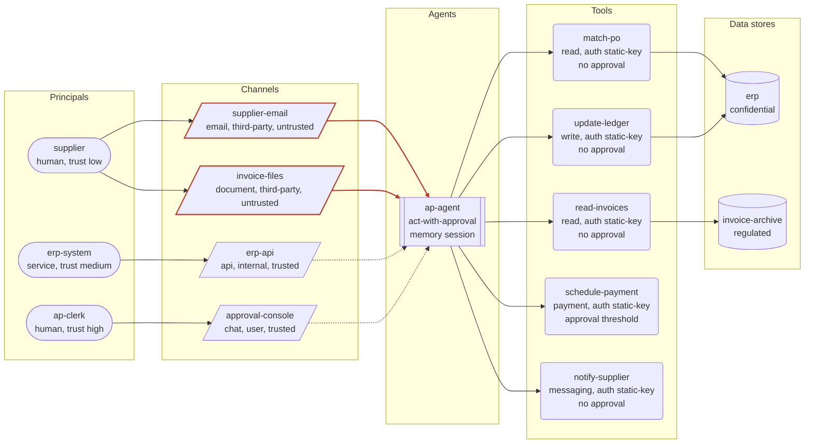

# Threat model: Accounts payable agent

Generated by agent-threat-model 0.1.1 from `examples/finance-agent.yaml`. Deterministic output: the same input always produces this report.

Reads supplier invoices from email and attachments, matches them against purchase orders in the ERP, posts ledger entries, schedules payments and emails suppliers about status.

Owner: finance-systems team

## Executive summary

20 of the catalogue threats apply to 'Accounts payable agent' (0 critical, 8 high, 12 medium, 0 low after mitigations). Residual risk score 90/100 (Critical). The 1 control(s) in place reduce modelled risk by 10% compared with the same system with no controls.

| Severity | Inherent | Residual |
|---|---|---|
| Critical | 0 | 0 |
| High | 12 | 8 |
| Medium | 8 | 12 |
| Low | 0 | 0 |

Top threats after mitigations:

1. **Credential exfiltration through tool call arguments** (`credential-exfiltration-via-tool-args`), residual 15 High: tool 'read-invoices' (read) uses auth: static-key
1. **Sensitive data reachable by the model** (`sensitive-data-disclosure`), residual 15 High: agent 'ap-agent' reaches regulated store 'invoice-archive' through tool 'read-invoices' (read)
1. **Indirect prompt injection via untrusted channel** (`indirect-prompt-injection`), residual 13.2 High: agent 'ap-agent' reads untrusted channel 'supplier-email' (email, origin third-party)

Highest-leverage missing controls:

- `audit-log` Tamper-evident audit log of every tool call: mitigates 9 applicable threat(s)
- `least-privilege-tool-scopes` Least-privilege scopes on every tool: mitigates 6 applicable threat(s)
- `runtime-policy-enforcement` Enforce policy outside the model: mitigates 5 applicable threat(s)
- `kill-switch` Kill switch with credential revocation: mitigates 4 applicable threat(s)
- `adversarial-testing` Adversarial testing before and after release: mitigates 4 applicable threat(s)

## System diagram

Dashed edges are trusted channels; solid red edges are untrusted channels (attacker-influenced content reaches the agent).

## System overview

| Element | Id | Details |
|---|---|---|
| Principal | `supplier` | human, trust low |
| Principal | `ap-clerk` | human, trust high |
| Principal | `erp-system` | service, trust medium |
| Agent | `ap-agent` | autonomy act-with-approval, memory session, inputs 4, tools 5 |
| Channel | `supplier-email` | email, origin third-party, untrusted |
| Channel | `invoice-files` | document, origin third-party, untrusted |
| Channel | `erp-api` | api, origin internal, trusted |
| Channel | `approval-console` | chat, origin user, trusted |
| Tool | `read-invoices` | read, auth static-key, approval none |
| Tool | `match-po` | read, auth static-key, approval none |
| Tool | `update-ledger` | write, auth static-key, approval none |
| Tool | `schedule-payment` | payment, auth static-key, approval threshold |
| Tool | `notify-supplier` | messaging, auth static-key, approval none |
| Data store | `erp` | confidential |
| Data store | `invoice-archive` | regulated |

## Threat register

| # | Threat | STRIDE | OWASP LLM | Inherent | Residual | Affected |
|---|---|---|---|---|---|---|
| 1 | [Credential exfiltration through tool call arguments](#1-credential-exfiltration-through-tool-call-arguments-credential-exfiltration-via-tool-args) | Information disclosure | LLM02, LLM01 | 15 High | 15 High | `ap-agent`, `match-po`, `notify-supplier`, `read-invoices`, `schedule-payment`, `update-ledger` |
| 2 | [Sensitive data reachable by the model](#2-sensitive-data-reachable-by-the-model-sensitive-data-disclosure) | Information disclosure | LLM02 | 15 High | 15 High | `ap-agent`, `erp`, `invoice-archive`, `match-po`, `read-invoices`, `update-ledger` |
| 3 | [Indirect prompt injection via untrusted channel](#3-indirect-prompt-injection-via-untrusted-channel-indirect-prompt-injection) | Tampering | LLM01 | 16 High | 13.2 High | `ap-agent`, `invoice-files`, `supplier-email` |
| 4 | [Excessive agency on write, exec or payment tools](#4-excessive-agency-on-write-exec-or-payment-tools-excessive-agency) | Elevation of privilege | LLM06 | 16 High | 12.9 High | `ap-agent`, `update-ledger` |
| 5 | [Data exfiltration through messaging tools](#5-data-exfiltration-through-messaging-tools-data-exfiltration-via-messaging) | Information disclosure | LLM02, LLM01 | 15 High | 12.1 High | `ap-agent`, `erp`, `invoice-archive`, `invoice-files`, `match-po`, `notify-supplier`, `read-invoices`, `supplier-email`, `update-ledger` |
| 6 | [No tamper-evident audit trail of tool calls](#6-no-tamper-evident-audit-trail-of-tool-calls-missing-audit-trail) | Repudiation | - | 12 High | 12 High | `ap-agent` |
| 7 | [No kill switch or credential revocation](#7-no-kill-switch-or-credential-revocation-missing-kill-switch) | Elevation of privilege | LLM06 | 12 High | 12 High | `ap-agent` |
| 8 | [Static long-lived credentials held by the agent](#8-static-long-lived-credentials-held-by-the-agent-static-long-lived-credentials) | Information disclosure | LLM02 | 12 High | 12 High | `ap-agent`, `match-po`, `notify-supplier`, `read-invoices`, `schedule-payment`, `update-ledger` |
| 9 | [Human-in-the-loop enforced only in the prompt](#9-human-in-the-loop-enforced-only-in-the-prompt-hitl-bypass) | Elevation of privilege | LLM06, LLM01 | 15 High | 11.1 Medium | `ap-agent` |
| 10 | [Direct prompt injection and jailbreak by a user](#10-direct-prompt-injection-and-jailbreak-by-a-user-direct-prompt-injection) | Tampering | LLM01 | 12 High | 9.7 Medium | `ap-agent`, `approval-console` |
| 11 | [Denial of wallet](#11-denial-of-wallet-denial-of-wallet) | Denial of service | LLM10 | 12 High | 9.3 Medium | `ap-agent`, `schedule-payment` |
| 12 | [Model output consumed without validation](#12-model-output-consumed-without-validation-insecure-output-handling) | Tampering | LLM05 | 9 Medium | 9 Medium | `ap-agent`, `update-ledger` |
| 13 | [Malicious files and documents as input](#13-malicious-files-and-documents-as-input-malicious-file-input) | Tampering | LLM01 | 9 Medium | 9 Medium | `ap-agent`, `invoice-files` |
| 14 | [No rate limits on tool calls](#14-no-rate-limits-on-tool-calls-no-rate-limits) | Denial of service | LLM10 | 9 Medium | 9 Medium | `ap-agent` |
| 15 | [Destructive actions through write tools](#15-destructive-actions-through-write-tools-destructive-write-actions) | Tampering | LLM06, LLM01 | 12 High | 8.9 Medium | `ap-agent`, `invoice-files`, `supplier-email`, `update-ledger` |
| 16 | [Agent configuration tampering](#16-agent-configuration-tampering-agent-config-tampering) | Tampering | LLM03, LLM06 | 8 Medium | 8 Medium | `ap-agent`, `update-ledger` |
| 17 | [Memory leaks between users or sessions](#17-memory-leaks-between-users-or-sessions-session-cross-contamination) | Information disclosure | LLM02 | 8 Medium | 8 Medium | `ap-agent`, `approval-console` |
| 18 | [Unpinned model or tool versions](#18-unpinned-model-or-tool-versions-supply-chain-unpinned) | Tampering | LLM03 | 8 Medium | 8 Medium | `ap-agent`, `match-po`, `notify-supplier`, `read-invoices`, `schedule-payment`, `update-ledger` |
| 19 | [System prompt and configuration leakage](#19-system-prompt-and-configuration-leakage-system-prompt-leakage) | Information disclosure | LLM07 | 8 Medium | 8 Medium | `ap-agent`, `approval-console`, `invoice-files`, `supplier-email` |
| 20 | [Acting on hallucinated facts or identifiers](#20-acting-on-hallucinated-facts-or-identifiers-hallucinated-actions) | Tampering | LLM09, LLM06 | 9 Medium | 7 Medium | `ap-agent`, `schedule-payment`, `update-ledger` |

### 1. Credential exfiltration through tool call arguments (`credential-exfiltration-via-tool-args`)

A tool holds a static key that is visible to the model (in configuration, descriptions or memory) and another tool can send data outward. An injected instruction asks the model to place the secret into a URL, message body or file that leaves the system.

| Field | Value |
|---|---|
| STRIDE | Information disclosure |
| OWASP LLM Top 10 (2025) | LLM02 Sensitive Information Disclosure, LLM01 Prompt Injection |
| OWASP Agentic Top 10 (2026) | ASI02 Tool Misuse and Exploitation, ASI03 Identity and Privilege Abuse |
| MITRE ATLAS | [AML.T0098](https://atlas.mitre.org/techniques/AML.T0098), [AML.T0086](https://atlas.mitre.org/techniques/AML.T0086), [AML.T0083](https://atlas.mitre.org/techniques/AML.T0083) |
| Inherent severity | 15 (High): likelihood 3 x impact 5 |
| Residual severity | 15 (High), mitigation coverage 0% |
| Affected elements | `ap-agent`, `match-po`, `notify-supplier`, `read-invoices`, `schedule-payment`, `update-ledger` |
| Rule | `all(tool_auth_in(auth=static-key), agent_has_tool_kind(kinds=network|messaging|write))` |

Why it applies:

- tool 'read-invoices' (read) uses auth: static-key
- tool 'match-po' (read) uses auth: static-key
- tool 'update-ledger' (write) uses auth: static-key
- tool 'schedule-payment' (payment) uses auth: static-key
- tool 'notify-supplier' (messaging) uses auth: static-key
- agent 'ap-agent' can call tool 'update-ledger' (write)
- agent 'ap-agent' can call tool 'notify-supplier' (messaging)

Mitigations:

- [ ] `secrets-out-of-context` Keep secrets out of the model context
- [ ] `brokered-credentials` Short-lived, scoped, brokered credentials
- [ ] `egress-allowlist` Allowlist network egress and message recipients
- [ ] `argument-validation` Strict schemas for tool arguments
- [ ] `audit-log` Tamper-evident audit log of every tool call

### 2. Sensitive data reachable by the model (`sensitive-data-disclosure`)

The agent can read confidential or regulated records through a tool. Whatever enters the context can be summarised, quoted or exfiltrated, and a shared service account returns records the requesting user may not be entitled to.

| Field | Value |
|---|---|
| STRIDE | Information disclosure |
| OWASP LLM Top 10 (2025) | LLM02 Sensitive Information Disclosure |
| OWASP Agentic Top 10 (2026) | ASI03 Identity and Privilege Abuse, ASI02 Tool Misuse and Exploitation |
| MITRE ATLAS | [AML.T0057](https://atlas.mitre.org/techniques/AML.T0057), [AML.T0085.000](https://atlas.mitre.org/techniques/AML.T0085.000), [AML.T0036](https://atlas.mitre.org/techniques/AML.T0036) |
| Inherent severity | 15 (High): likelihood 3 x impact 5 (impact raised: regulated data in scope) |
| Residual severity | 15 (High), mitigation coverage 0% |
| Affected elements | `ap-agent`, `erp`, `invoice-archive`, `match-po`, `read-invoices`, `update-ledger` |
| Rule | `agent_reaches_sensitive_store(min=confidential)` |

Why it applies:

- agent 'ap-agent' reaches regulated store 'invoice-archive' through tool 'read-invoices' (read)
- agent 'ap-agent' reaches confidential store 'erp' through tool 'match-po' (read)
- agent 'ap-agent' reaches confidential store 'erp' through tool 'update-ledger' (write)

Mitigations:

- [ ] `per-user-authorisation` Access data with the end user's permissions
- [ ] `least-privilege-tool-scopes` Least-privilege scopes on every tool
- [ ] `dlp-outbound` Data loss prevention on outbound messages
- [ ] `audit-log` Tamper-evident audit log of every tool call

References:

- <https://github.com/OWASP/www-project-top-10-for-large-language-model-applications/blob/main/2_0_vulns/LLM02_SensitiveInformationDisclosure.md>

### 3. Indirect prompt injection via untrusted channel (`indirect-prompt-injection`)

Content the agent reads from an untrusted channel (email, web pages, documents, retrieved passages, API responses) carries instructions that the model follows as if they came from the operator. Every tool the agent can reach becomes available to whoever wrote that content.

| Field | Value |
|---|---|
| STRIDE | Tampering |
| OWASP LLM Top 10 (2025) | LLM01 Prompt Injection |
| OWASP Agentic Top 10 (2026) | ASI01 Agent Goal Hijack |
| MITRE ATLAS | [AML.T0051.001](https://atlas.mitre.org/techniques/AML.T0051.001) |
| Inherent severity | 16 (High): likelihood 4 x impact 4 |
| Residual severity | 13.2 (High), mitigation coverage 22% |
| Affected elements | `ap-agent`, `invoice-files`, `supplier-email` |
| Rule | `untrusted_channel_in_agent_inputs` |

Why it applies:

- agent 'ap-agent' reads untrusted channel 'supplier-email' (email, origin third-party)
- agent 'ap-agent' reads untrusted channel 'invoice-files' (document, origin third-party)

Mitigations:

- [x] `approval-gates` Human approval for high-impact actions
- [ ] `input-provenance-tagging` Tag every input with its provenance and trust level
- [ ] `untrusted-content-isolation` Isolate untrusted content from the privileged agent
- [ ] `prompt-injection-filtering` Detect injection attempts in untrusted content
- [ ] `least-privilege-tool-scopes` Least-privilege scopes on every tool

References:

- <https://github.com/OWASP/www-project-top-10-for-large-language-model-applications/blob/main/2_0_vulns/LLM01_PromptInjection.md>

### 4. Excessive agency on write, exec or payment tools (`excessive-agency`)

An agent that may act on its own can call a tool with side effects without any approval step. One wrong inference, one injected instruction or one hallucinated argument becomes a real-world action.

| Field | Value |
|---|---|
| STRIDE | Elevation of privilege |
| OWASP LLM Top 10 (2025) | LLM06 Excessive Agency |
| OWASP Agentic Top 10 (2026) | ASI02 Tool Misuse and Exploitation, ASI03 Identity and Privilege Abuse |
| MITRE ATLAS | [AML.T0053](https://atlas.mitre.org/techniques/AML.T0053) |
| Inherent severity | 16 (High): likelihood 4 x impact 4 |
| Residual severity | 12.9 (High), mitigation coverage 24% |
| Affected elements | `ap-agent`, `update-ledger` |
| Rule | `tool_kind_without_approval(kinds=write|exec|payment)` |

Why it applies:

- agent 'ap-agent' (act-with-approval) can call tool 'update-ledger' (write) with approval: none

Mitigations:

- [x] `approval-gates` Human approval for high-impact actions
- [ ] `runtime-policy-enforcement` Enforce policy outside the model
- [ ] `least-privilege-tool-scopes` Least-privilege scopes on every tool
- [ ] `audit-log` Tamper-evident audit log of every tool call
- [ ] `kill-switch` Kill switch with credential revocation

References:

- <https://github.com/OWASP/www-project-top-10-for-large-language-model-applications/blob/main/2_0_vulns/LLM06_ExcessiveAgency.md>

### 5. Data exfiltration through messaging tools (`data-exfiltration-via-messaging`)

The agent can send email or chat messages and also reads untrusted content or sensitive data. An injected instruction forwards that data to an attacker-chosen recipient in a message that looks routine.

| Field | Value |
|---|---|
| STRIDE | Information disclosure |
| OWASP LLM Top 10 (2025) | LLM02 Sensitive Information Disclosure, LLM01 Prompt Injection |
| OWASP Agentic Top 10 (2026) | ASI02 Tool Misuse and Exploitation |
| MITRE ATLAS | [AML.T0086](https://atlas.mitre.org/techniques/AML.T0086), [AML.T0025](https://atlas.mitre.org/techniques/AML.T0025) |
| Inherent severity | 15 (High): likelihood 3 x impact 5 |
| Residual severity | 12.1 (High), mitigation coverage 24% |
| Affected elements | `ap-agent`, `erp`, `invoice-archive`, `invoice-files`, `match-po`, `notify-supplier`, `read-invoices`, `supplier-email`, `update-ledger` |
| Rule | `all(agent_has_tool_kind(kinds=messaging), any(untrusted_channel_in_agent_inputs, agent_reaches_sensitive_store(min=confidential)))` |

Why it applies:

- agent 'ap-agent' can call tool 'notify-supplier' (messaging)
- agent 'ap-agent' reads untrusted channel 'supplier-email' (email, origin third-party)
- agent 'ap-agent' reads untrusted channel 'invoice-files' (document, origin third-party)
- agent 'ap-agent' reaches regulated store 'invoice-archive' through tool 'read-invoices' (read)
- agent 'ap-agent' reaches confidential store 'erp' through tool 'match-po' (read)
- agent 'ap-agent' reaches confidential store 'erp' through tool 'update-ledger' (write)

Mitigations:

- [x] `approval-gates` Human approval for high-impact actions
- [ ] `egress-allowlist` Allowlist network egress and message recipients
- [ ] `dlp-outbound` Data loss prevention on outbound messages
- [ ] `input-provenance-tagging` Tag every input with its provenance and trust level
- [ ] `audit-log` Tamper-evident audit log of every tool call

### 6. No tamper-evident audit trail of tool calls (`missing-audit-trail`)

Tool calls are not recorded in a store the agent cannot modify. After an incident nobody can say which input triggered which action, and the agent's actions can be repudiated or quietly altered.

| Field | Value |
|---|---|
| STRIDE | Repudiation |
| OWASP LLM Top 10 (2025) | - |
| OWASP Agentic Top 10 (2026) | ASI10 Rogue Agents |
| MITRE ATLAS | - |
| Inherent severity | 12 (High): likelihood 4 x impact 3 |
| Residual severity | 12 (High), mitigation coverage 0% |
| Affected elements | `ap-agent` |
| Rule | `all(control_missing(control=audit-log), agent_has_any_tool)` |

Why it applies:

- control 'audit-log' is not in place
- agent 'ap-agent' can call 5 tool(s)

Mitigations:

- [ ] `audit-log` Tamper-evident audit log of every tool call
- [ ] `behavioural-monitoring` Monitor agent behaviour for anomalies
- [ ] `incident-response-playbook` Incident response playbook for agent incidents

References:

- <https://atlas.mitre.org/mitigations/AML.M0024>

### 7. No kill switch or credential revocation (`missing-kill-switch`)

An agent that acts in the world cannot be stopped quickly. When behaviour goes wrong the only options are to find the process and the keys by hand while actions keep happening.

| Field | Value |
|---|---|
| STRIDE | Elevation of privilege |
| OWASP LLM Top 10 (2025) | LLM06 Excessive Agency |
| OWASP Agentic Top 10 (2026) | ASI10 Rogue Agents, ASI08 Cascading Agent Failures |
| MITRE ATLAS | - |
| Inherent severity | 12 (High): likelihood 3 x impact 4 |
| Residual severity | 12 (High), mitigation coverage 0% |
| Affected elements | `ap-agent` |
| Rule | `all(control_missing(control=kill-switch), agent_autonomy_in(autonomy=act|act-with-approval))` |

Why it applies:

- control 'kill-switch' is not in place
- agent 'ap-agent' has autonomy act-with-approval

Mitigations:

- [ ] `kill-switch` Kill switch with credential revocation
- [ ] `brokered-credentials` Short-lived, scoped, brokered credentials
- [ ] `incident-response-playbook` Incident response playbook for agent incidents

### 8. Static long-lived credentials held by the agent (`static-long-lived-credentials`)

Tools authenticate with static keys that do not expire. If a key leaks through logs, prompts or an injected exfiltration it remains valid until someone notices, and it cannot be scoped to a single task.

| Field | Value |
|---|---|
| STRIDE | Information disclosure |
| OWASP LLM Top 10 (2025) | LLM02 Sensitive Information Disclosure |
| OWASP Agentic Top 10 (2026) | ASI03 Identity and Privilege Abuse |
| MITRE ATLAS | [AML.T0055](https://atlas.mitre.org/techniques/AML.T0055), [AML.T0083](https://atlas.mitre.org/techniques/AML.T0083) |
| Inherent severity | 12 (High): likelihood 3 x impact 4 |
| Residual severity | 12 (High), mitigation coverage 0% |
| Affected elements | `ap-agent`, `match-po`, `notify-supplier`, `read-invoices`, `schedule-payment`, `update-ledger` |
| Rule | `tool_auth_in(auth=static-key)` |

Why it applies:

- tool 'read-invoices' (read) uses auth: static-key
- tool 'match-po' (read) uses auth: static-key
- tool 'update-ledger' (write) uses auth: static-key
- tool 'schedule-payment' (payment) uses auth: static-key
- tool 'notify-supplier' (messaging) uses auth: static-key

Mitigations:

- [ ] `brokered-credentials` Short-lived, scoped, brokered credentials
- [ ] `secrets-out-of-context` Keep secrets out of the model context
- [ ] `audit-log` Tamper-evident audit log of every tool call
- [ ] `kill-switch` Kill switch with credential revocation

### 9. Human-in-the-loop enforced only in the prompt (`hitl-bypass`)

The agent is meant to ask before acting, but the rule lives in the prompt. An injected instruction, a jailbreak or a tool that calls another tool routes around the human.

| Field | Value |
|---|---|
| STRIDE | Elevation of privilege |
| OWASP LLM Top 10 (2025) | LLM06 Excessive Agency, LLM01 Prompt Injection |
| OWASP Agentic Top 10 (2026) | ASI09 Human-Agent Trust Exploitation, ASI01 Agent Goal Hijack |
| MITRE ATLAS | [AML.T0053](https://atlas.mitre.org/techniques/AML.T0053) |
| Inherent severity | 15 (High): likelihood 3 x impact 5 |
| Residual severity | 11.1 (Medium), mitigation coverage 32% |
| Affected elements | `ap-agent` |
| Rule | `all(agent_autonomy_in(autonomy=act-with-approval), control_missing(control=runtime-policy-enforcement))` |

Why it applies:

- agent 'ap-agent' has autonomy act-with-approval
- control 'runtime-policy-enforcement' is not in place

Mitigations:

- [x] `approval-gates` Human approval for high-impact actions
- [ ] `runtime-policy-enforcement` Enforce policy outside the model
- [ ] `audit-log` Tamper-evident audit log of every tool call
- [ ] `kill-switch` Kill switch with credential revocation

### 10. Direct prompt injection and jailbreak by a user (`direct-prompt-injection`)

A user types instructions that override the system prompt or safety guidance, then uses the agent's tools for purposes the operator did not intend. Any agent that accepts user input and has tools is exposed.

| Field | Value |
|---|---|
| STRIDE | Tampering |
| OWASP LLM Top 10 (2025) | LLM01 Prompt Injection |
| OWASP Agentic Top 10 (2026) | ASI01 Agent Goal Hijack |
| MITRE ATLAS | [AML.T0051.000](https://atlas.mitre.org/techniques/AML.T0051.000), [AML.T0054](https://atlas.mitre.org/techniques/AML.T0054) |
| Inherent severity | 12 (High): likelihood 4 x impact 3 |
| Residual severity | 9.7 (Medium), mitigation coverage 24% |
| Affected elements | `ap-agent`, `approval-console` |
| Rule | `all(agent_has_input_of_origin(origin=user), agent_has_any_tool)` |

Why it applies:

- agent 'ap-agent' reads channel 'approval-console' with origin user
- agent 'ap-agent' can call 5 tool(s)

Mitigations:

- [x] `approval-gates` Human approval for high-impact actions
- [ ] `least-privilege-tool-scopes` Least-privilege scopes on every tool
- [ ] `runtime-policy-enforcement` Enforce policy outside the model
- [ ] `prompt-injection-filtering` Detect injection attempts in untrusted content
- [ ] `adversarial-testing` Adversarial testing before and after release

### 11. Denial of wallet (`denial-of-wallet`)

The agent can spend money or paid API quota and nothing caps the amount per task. A loop, an injection or a malicious user turns the agent into a bill.

| Field | Value |
|---|---|
| STRIDE | Denial of service |
| OWASP LLM Top 10 (2025) | LLM10 Unbounded Consumption |
| OWASP Agentic Top 10 (2026) | ASI08 Cascading Agent Failures |
| MITRE ATLAS | [AML.T0034.002](https://atlas.mitre.org/techniques/AML.T0034.002), [AML.T0034](https://atlas.mitre.org/techniques/AML.T0034) |
| Inherent severity | 12 (High): likelihood 3 x impact 4 |
| Residual severity | 9.3 (Medium), mitigation coverage 28% |
| Affected elements | `ap-agent`, `schedule-payment` |
| Rule | `all(control_missing(control=budget-caps), any(agent_has_tool_kind(kinds=payment|network), agent_autonomy_in(autonomy=act)))` |

Why it applies:

- control 'budget-caps' is not in place
- agent 'ap-agent' can call tool 'schedule-payment' (payment)

Mitigations:

- [x] `approval-gates` Human approval for high-impact actions
- [ ] `budget-caps` Hard budget caps on spend and tokens
- [ ] `rate-limiting` Rate limits on tool calls and iterations
- [ ] `behavioural-monitoring` Monitor agent behaviour for anomalies

References:

- <https://github.com/OWASP/www-project-top-10-for-large-language-model-applications/blob/main/2_0_vulns/LLM10_UnboundedConsumption.md>

### 12. Model output consumed without validation (`insecure-output-handling`)

Downstream components render model output in a browser, pass it to a shell or database, or execute it. Injected or malformed output becomes cross-site scripting, command injection or unintended writes.

| Field | Value |
|---|---|
| STRIDE | Tampering |
| OWASP LLM Top 10 (2025) | LLM05 Improper Output Handling |
| OWASP Agentic Top 10 (2026) | ASI05 Unexpected Code Execution |
| MITRE ATLAS | [AML.T0077](https://atlas.mitre.org/techniques/AML.T0077), [AML.T0067](https://atlas.mitre.org/techniques/AML.T0067) |
| Inherent severity | 9 (Medium): likelihood 3 x impact 3 |
| Residual severity | 9 (Medium), mitigation coverage 0% |
| Affected elements | `ap-agent`, `update-ledger` |
| Rule | `any(agent_has_tool_kind(kinds=exec|write), agent_has_channel_kind(kinds=web))` |

Why it applies:

- agent 'ap-agent' can call tool 'update-ledger' (write)

Mitigations:

- [ ] `output-encoding` Treat model output as untrusted data downstream
- [ ] `argument-validation` Strict schemas for tool arguments
- [ ] `sandboxed-execution` Run code and shell tools in an ephemeral sandbox

References:

- <https://github.com/OWASP/www-project-top-10-for-large-language-model-applications/blob/main/2_0_vulns/LLM05_ImproperOutputHandling.md>

### 13. Malicious files and documents as input (`malicious-file-input`)

The agent parses files or documents. Crafted files exploit parser bugs, hide instructions in metadata or invisible text, and carry macros or links that later tools act on.

| Field | Value |
|---|---|
| STRIDE | Tampering |
| OWASP LLM Top 10 (2025) | LLM01 Prompt Injection |
| OWASP Agentic Top 10 (2026) | ASI01 Agent Goal Hijack |
| MITRE ATLAS | [AML.T0051.001](https://atlas.mitre.org/techniques/AML.T0051.001), [AML.T0011.000](https://atlas.mitre.org/techniques/AML.T0011.000) |
| Inherent severity | 9 (Medium): likelihood 3 x impact 3 |
| Residual severity | 9 (Medium), mitigation coverage 0% |
| Affected elements | `ap-agent`, `invoice-files` |
| Rule | `agent_has_channel_kind(kinds=file|document, untrusted=true)` |

Why it applies:

- agent 'ap-agent' reads untrusted document channel 'invoice-files'

Mitigations:

- [ ] `untrusted-content-isolation` Isolate untrusted content from the privileged agent
- [ ] `sandboxed-execution` Run code and shell tools in an ephemeral sandbox
- [ ] `prompt-injection-filtering` Detect injection attempts in untrusted content
- [ ] `input-provenance-tagging` Tag every input with its provenance and trust level

### 14. No rate limits on tool calls (`no-rate-limits`)

Nothing bounds how many tool calls or loop iterations an agent may make. A runaway loop or an attacker-driven burst exhausts quotas, floods downstream systems and amplifies every other threat.

| Field | Value |
|---|---|
| STRIDE | Denial of service |
| OWASP LLM Top 10 (2025) | LLM10 Unbounded Consumption |
| OWASP Agentic Top 10 (2026) | ASI08 Cascading Agent Failures |
| MITRE ATLAS | [AML.T0029](https://atlas.mitre.org/techniques/AML.T0029), [AML.T0034](https://atlas.mitre.org/techniques/AML.T0034) |
| Inherent severity | 9 (Medium): likelihood 3 x impact 3 |
| Residual severity | 9 (Medium), mitigation coverage 0% |
| Affected elements | `ap-agent` |
| Rule | `all(control_missing(control=rate-limiting), agent_has_any_tool)` |

Why it applies:

- control 'rate-limiting' is not in place
- agent 'ap-agent' can call 5 tool(s)

Mitigations:

- [ ] `rate-limiting` Rate limits on tool calls and iterations
- [ ] `budget-caps` Hard budget caps on spend and tokens
- [ ] `behavioural-monitoring` Monitor agent behaviour for anomalies

### 15. Destructive actions through write tools (`destructive-write-actions`)

The agent can modify or delete data and reads untrusted content. An injected instruction (or a plain mistake) deletes records, overwrites files or force-pushes over history.

| Field | Value |
|---|---|
| STRIDE | Tampering |
| OWASP LLM Top 10 (2025) | LLM06 Excessive Agency, LLM01 Prompt Injection |
| OWASP Agentic Top 10 (2026) | ASI02 Tool Misuse and Exploitation |
| MITRE ATLAS | [AML.T0101](https://atlas.mitre.org/techniques/AML.T0101) |
| Inherent severity | 12 (High): likelihood 3 x impact 4 |
| Residual severity | 8.9 (Medium), mitigation coverage 32% |
| Affected elements | `ap-agent`, `invoice-files`, `supplier-email`, `update-ledger` |
| Rule | `all(agent_has_tool_kind(kinds=write), untrusted_channel_in_agent_inputs)` |

Why it applies:

- agent 'ap-agent' can call tool 'update-ledger' (write)
- agent 'ap-agent' reads untrusted channel 'supplier-email' (email, origin third-party)
- agent 'ap-agent' reads untrusted channel 'invoice-files' (document, origin third-party)

Mitigations:

- [x] `approval-gates` Human approval for high-impact actions
- [ ] `backups-and-rollback` Backups and rollback for agent-writable data
- [ ] `least-privilege-tool-scopes` Least-privilege scopes on every tool
- [ ] `audit-log` Tamper-evident audit log of every tool call

### 16. Agent configuration tampering (`agent-config-tampering`)

Prompts, tool lists and policies live in files or stores an agent can write to, or that lack change control. Modifying them silently changes what the agent is allowed to do.

| Field | Value |
|---|---|
| STRIDE | Tampering |
| OWASP LLM Top 10 (2025) | LLM03 Supply Chain, LLM06 Excessive Agency |
| OWASP Agentic Top 10 (2026) | ASI10 Rogue Agents, ASI04 Agentic Supply Chain Vulnerabilities |
| MITRE ATLAS | [AML.T0081](https://atlas.mitre.org/techniques/AML.T0081) |
| Inherent severity | 8 (Medium): likelihood 2 x impact 4 |
| Residual severity | 8 (Medium), mitigation coverage 0% |
| Affected elements | `ap-agent`, `update-ledger` |
| Rule | `all(agent_has_tool_kind(kinds=write|exec), control_missing(control=runtime-policy-enforcement))` |

Why it applies:

- agent 'ap-agent' can call tool 'update-ledger' (write)
- control 'runtime-policy-enforcement' is not in place

Mitigations:

- [ ] `runtime-policy-enforcement` Enforce policy outside the model
- [ ] `tool-integrity-pinning` Pin tool versions and hash tool descriptions
- [ ] `audit-log` Tamper-evident audit log of every tool call
- [ ] `least-privilege-tool-scopes` Least-privilege scopes on every tool

### 17. Memory leaks between users or sessions (`session-cross-contamination`)

The agent keeps memory and serves more than one user. Without strict partitioning, one user's data or instructions surface in another user's session.

| Field | Value |
|---|---|
| STRIDE | Information disclosure |
| OWASP LLM Top 10 (2025) | LLM02 Sensitive Information Disclosure |
| OWASP Agentic Top 10 (2026) | ASI06 Memory and Context Poisoning |
| MITRE ATLAS | [AML.T0057](https://atlas.mitre.org/techniques/AML.T0057), [AML.T0092](https://atlas.mitre.org/techniques/AML.T0092) |
| Inherent severity | 8 (Medium): likelihood 2 x impact 4 |
| Residual severity | 8 (Medium), mitigation coverage 0% |
| Affected elements | `ap-agent`, `approval-console` |
| Rule | `all(agent_memory_is(memory=session|persistent), agent_has_input_of_origin(origin=user))` |

Why it applies:

- agent 'ap-agent' keeps session memory
- agent 'ap-agent' reads channel 'approval-console' with origin user

Mitigations:

- [ ] `session-isolation` Isolate memory and context per user and session
- [ ] `per-user-authorisation` Access data with the end user's permissions
- [ ] `memory-write-validation` Validate and expire writes to persistent memory

### 18. Unpinned model or tool versions (`supply-chain-unpinned`)

The model version, tool packages or tool servers are not pinned. A silent upstream change (or a deliberate rug pull) alters behaviour and permissions without any review.

| Field | Value |
|---|---|
| STRIDE | Tampering |
| OWASP LLM Top 10 (2025) | LLM03 Supply Chain |
| OWASP Agentic Top 10 (2026) | ASI04 Agentic Supply Chain Vulnerabilities |
| MITRE ATLAS | [AML.T0010](https://atlas.mitre.org/techniques/AML.T0010), [AML.T0010.005](https://atlas.mitre.org/techniques/AML.T0010.005), [AML.T0109](https://atlas.mitre.org/techniques/AML.T0109) |
| Inherent severity | 8 (Medium): likelihood 2 x impact 4 |
| Residual severity | 8 (Medium), mitigation coverage 0% |
| Affected elements | `ap-agent`, `match-po`, `notify-supplier`, `read-invoices`, `schedule-payment`, `update-ledger` |
| Rule | `any(agent_model_unpinned, tool_unpinned)` |

Why it applies:

- agent 'ap-agent' does not declare a pinned model version
- tool 'read-invoices' (read) version or description is not pinned
- tool 'match-po' (read) version or description is not pinned
- tool 'update-ledger' (write) version or description is not pinned
- tool 'schedule-payment' (payment) version or description is not pinned
- tool 'notify-supplier' (messaging) version or description is not pinned

Mitigations:

- [ ] `tool-integrity-pinning` Pin tool versions and hash tool descriptions
- [ ] `model-version-pinning` Pin and change-control the model version
- [ ] `adversarial-testing` Adversarial testing before and after release

References:

- <https://github.com/OWASP/www-project-top-10-for-large-language-model-applications/blob/main/2_0_vulns/LLM03_SupplyChain.md>

### 19. System prompt and configuration leakage (`system-prompt-leakage`)

Users or third-party content can coax the model into revealing its system prompt, tool list and configuration. On its own this is reconnaissance; it becomes serious when the prompt holds secrets or business rules.

| Field | Value |
|---|---|
| STRIDE | Information disclosure |
| OWASP LLM Top 10 (2025) | LLM07 System Prompt Leakage |
| OWASP Agentic Top 10 (2026) | not mapped |
| MITRE ATLAS | [AML.T0056](https://atlas.mitre.org/techniques/AML.T0056), [AML.T0069.002](https://atlas.mitre.org/techniques/AML.T0069.002), [AML.T0084](https://atlas.mitre.org/techniques/AML.T0084), [AML.T0084.001](https://atlas.mitre.org/techniques/AML.T0084.001) |
| Inherent severity | 8 (Medium): likelihood 4 x impact 2 |
| Residual severity | 8 (Medium), mitigation coverage 0% |
| Affected elements | `ap-agent`, `approval-console`, `invoice-files`, `supplier-email` |
| Rule | `agent_has_input_of_origin(origin=user|third-party)` |

Why it applies:

- agent 'ap-agent' reads channel 'supplier-email' with origin third-party
- agent 'ap-agent' reads channel 'invoice-files' with origin third-party
- agent 'ap-agent' reads channel 'approval-console' with origin user

Mitigations:

- [ ] `secrets-out-of-context` Keep secrets out of the model context
- [ ] `runtime-policy-enforcement` Enforce policy outside the model
- [ ] `adversarial-testing` Adversarial testing before and after release

References:

- <https://github.com/OWASP/www-project-top-10-for-large-language-model-applications/blob/main/2_0_vulns/LLM07_SystemPromptLeakage.md>

### 20. Acting on hallucinated facts or identifiers (`hallucinated-actions`)

The agent invents a package name, account id, file path or amount and a side-effecting tool executes it. Attackers register the names models tend to invent so the mistake resolves to something malicious.

| Field | Value |
|---|---|
| STRIDE | Tampering |
| OWASP LLM Top 10 (2025) | LLM09 Misinformation, LLM06 Excessive Agency |
| OWASP Agentic Top 10 (2026) | ASI02 Tool Misuse and Exploitation, ASI04 Agentic Supply Chain Vulnerabilities |
| MITRE ATLAS | [AML.T0060](https://atlas.mitre.org/techniques/AML.T0060), [AML.T0053](https://atlas.mitre.org/techniques/AML.T0053) |
| Inherent severity | 9 (Medium): likelihood 3 x impact 3 |
| Residual severity | 7 (Medium), mitigation coverage 28% |
| Affected elements | `ap-agent`, `schedule-payment`, `update-ledger` |
| Rule | `all(agent_autonomy_in(autonomy=act|act-with-approval), agent_has_tool_kind(kinds=exec|write|payment))` |

Why it applies:

- agent 'ap-agent' has autonomy act-with-approval
- agent 'ap-agent' can call tool 'update-ledger' (write)
- agent 'ap-agent' can call tool 'schedule-payment' (payment)

Mitigations:

- [x] `approval-gates` Human approval for high-impact actions
- [ ] `argument-validation` Strict schemas for tool arguments
- [ ] `tool-integrity-pinning` Pin tool versions and hash tool descriptions
- [ ] `adversarial-testing` Adversarial testing before and after release

References:

- <https://arxiv.org/abs/2406.10279>

## Control checklist

Controls that mitigate at least one applicable threat, grouped by implementation effort. Checked items are already declared in the system description.

### Low effort

- [ ] `kill-switch` Kill switch with credential revocation (corrective); `excessive-agency`, `missing-kill-switch`, `static-long-lived-credentials`, `hitl-bypass`
- [ ] `argument-validation` Strict schemas for tool arguments (preventive); `credential-exfiltration-via-tool-args`, `insecure-output-handling`, `hallucinated-actions`
- [ ] `prompt-injection-filtering` Detect injection attempts in untrusted content (detective); `indirect-prompt-injection`, `direct-prompt-injection`, `malicious-file-input`
- [ ] `secrets-out-of-context` Keep secrets out of the model context (preventive); `credential-exfiltration-via-tool-args`, `static-long-lived-credentials`, `system-prompt-leakage`
- [ ] `tool-integrity-pinning` Pin tool versions and hash tool descriptions (preventive); `agent-config-tampering`, `supply-chain-unpinned`, `hallucinated-actions`
- [ ] `budget-caps` Hard budget caps on spend and tokens (preventive); `denial-of-wallet`, `no-rate-limits`
- [ ] `egress-allowlist` Allowlist network egress and message recipients (preventive); `credential-exfiltration-via-tool-args`, `data-exfiltration-via-messaging`
- [ ] `incident-response-playbook` Incident response playbook for agent incidents (corrective); `missing-audit-trail`, `missing-kill-switch`
- [ ] `rate-limiting` Rate limits on tool calls and iterations (preventive); `denial-of-wallet`, `no-rate-limits`
- [ ] `model-version-pinning` Pin and change-control the model version (preventive); `supply-chain-unpinned`
- [ ] `output-encoding` Treat model output as untrusted data downstream (preventive); `insecure-output-handling`

### Medium effort

- [ ] `audit-log` Tamper-evident audit log of every tool call (detective); `credential-exfiltration-via-tool-args`, `sensitive-data-disclosure`, `excessive-agency`, `data-exfiltration-via-messaging`, `missing-audit-trail`, `static-long-lived-credentials`, `hitl-bypass`, `destructive-write-actions`, `agent-config-tampering`
- [ ] `least-privilege-tool-scopes` Least-privilege scopes on every tool (preventive); `sensitive-data-disclosure`, `indirect-prompt-injection`, `excessive-agency`, `direct-prompt-injection`, `destructive-write-actions`, `agent-config-tampering`
- [ ] `runtime-policy-enforcement` Enforce policy outside the model (preventive); `excessive-agency`, `hitl-bypass`, `direct-prompt-injection`, `agent-config-tampering`, `system-prompt-leakage`
- [ ] `adversarial-testing` Adversarial testing before and after release (detective); `direct-prompt-injection`, `supply-chain-unpinned`, `system-prompt-leakage`, `hallucinated-actions`
- [ ] `brokered-credentials` Short-lived, scoped, brokered credentials (preventive); `credential-exfiltration-via-tool-args`, `missing-kill-switch`, `static-long-lived-credentials`
- [ ] `input-provenance-tagging` Tag every input with its provenance and trust level (preventive); `indirect-prompt-injection`, `data-exfiltration-via-messaging`, `malicious-file-input`
- [ ] `dlp-outbound` Data loss prevention on outbound messages (detective); `sensitive-data-disclosure`, `data-exfiltration-via-messaging`
- [ ] `per-user-authorisation` Access data with the end user's permissions (preventive); `sensitive-data-disclosure`, `session-cross-contamination`
- [ ] `sandboxed-execution` Run code and shell tools in an ephemeral sandbox (preventive); `insecure-output-handling`, `malicious-file-input`
- [ ] `backups-and-rollback` Backups and rollback for agent-writable data (corrective); `destructive-write-actions`
- [ ] `memory-write-validation` Validate and expire writes to persistent memory (preventive); `session-cross-contamination`
- [ ] `session-isolation` Isolate memory and context per user and session (preventive); `session-cross-contamination`
- [x] `approval-gates` Human approval for high-impact actions (preventive); `indirect-prompt-injection`, `excessive-agency`, `data-exfiltration-via-messaging`, `hitl-bypass`, `direct-prompt-injection`, `denial-of-wallet`, `destructive-write-actions`, `hallucinated-actions`

### High effort

- [ ] `behavioural-monitoring` Monitor agent behaviour for anomalies (detective); `missing-audit-trail`, `denial-of-wallet`, `no-rate-limits`
- [ ] `untrusted-content-isolation` Isolate untrusted content from the privileged agent (preventive); `indirect-prompt-injection`, `malicious-file-input`

## Residual risk

**Residual risk score: 90/100 (Critical)**

- Inherent severity total for applicable threats: 232
- Residual severity total after declared controls: 209.2
- Inherent total with no controls at all (baseline): 232
- Score = 100 x residual / baseline = 90; declared controls remove 10% of modelled risk

Per threat: inherent = likelihood x impact (1..25); impact is raised by one when a regulated data store is affected; residual = inherent x (1 - 0.8 x coverage), where coverage weights controls in place by type (preventive 1.0, detective 0.6, corrective 0.5). A fully mitigated threat keeps 20% of its inherent score.

## Method and limits

This report is produced by deterministic rules over the declared architecture, with no model in the loop. It cannot see implementation detail, so a threat that does not apply here may still exist in code, and a declared control is taken at face value. Treat it as a starting checklist for a review, not as a verdict.
