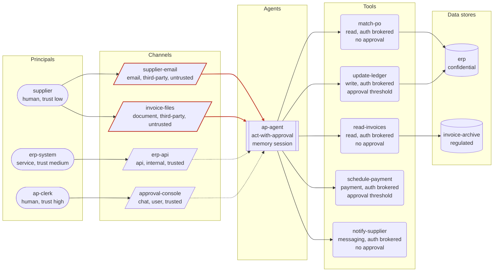

# Threat model: Accounts payable agent (governed)

Generated by agent-threat-model 0.1.1 from `examples/governed-agent.yaml`. Deterministic output: the same input always produces this report.

Reads supplier invoices from email and attachments, matches them against purchase orders in the ERP, posts ledger entries, schedules payments and emails suppliers about status. Credentials are brokered per task and every side effect passes a policy enforcement point.

Owner: finance-systems team

## Executive summary

10 of the catalogue threats apply to 'Accounts payable agent (governed)' (0 critical, 0 high, 3 medium, 7 low after mitigations). Residual risk score 27/100 (Medium). The 18 control(s) in place reduce modelled risk by 73% compared with the same system with no controls.

| Severity | Inherent | Residual |
|---|---|---|
| Critical | 0 | 0 |
| High | 5 | 0 |
| Medium | 5 | 3 |
| Low | 0 | 7 |

Top threats after mitigations:

1. **Indirect prompt injection via untrusted channel** (`indirect-prompt-injection`), residual 7.7 Medium: agent 'ap-agent' reads untrusted channel 'supplier-email' (email, origin third-party)
1. **Malicious files and documents as input** (`malicious-file-input`), residual 7 Medium: agent 'ap-agent' reads untrusted document channel 'invoice-files'
1. **Model output consumed without validation** (`insecure-output-handling`), residual 6.6 Medium: agent 'ap-agent' can call tool 'update-ledger' (write)

Highest-leverage missing controls:

- `prompt-injection-filtering` Detect injection attempts in untrusted content: mitigates 3 applicable threat(s)
- `adversarial-testing` Adversarial testing before and after release: mitigates 3 applicable threat(s)
- `sandboxed-execution` Run code and shell tools in an ephemeral sandbox: mitigates 2 applicable threat(s)
- `untrusted-content-isolation` Isolate untrusted content from the privileged agent: mitigates 2 applicable threat(s)
- `output-encoding` Treat model output as untrusted data downstream: mitigates 1 applicable threat(s)

## System diagram

Dashed edges are trusted channels; solid red edges are untrusted channels (attacker-influenced content reaches the agent).

## System overview

| Element | Id | Details |
|---|---|---|
| Principal | `supplier` | human, trust low |
| Principal | `ap-clerk` | human, trust high |
| Principal | `erp-system` | service, trust medium |
| Agent | `ap-agent` | autonomy act-with-approval, memory session, inputs 4, tools 5, model pinned |
| Channel | `supplier-email` | email, origin third-party, untrusted |
| Channel | `invoice-files` | document, origin third-party, untrusted |
| Channel | `erp-api` | api, origin internal, trusted |
| Channel | `approval-console` | chat, origin user, trusted |
| Tool | `read-invoices` | read, auth brokered, approval none, sandboxed, pinned |
| Tool | `match-po` | read, auth brokered, approval none, sandboxed, pinned |
| Tool | `update-ledger` | write, auth brokered, approval threshold, pinned |
| Tool | `schedule-payment` | payment, auth brokered, approval threshold, pinned |
| Tool | `notify-supplier` | messaging, auth brokered, approval none, pinned |
| Data store | `erp` | confidential |
| Data store | `invoice-archive` | regulated |

## Threat register

| # | Threat | STRIDE | OWASP LLM | Inherent | Residual | Affected |
|---|---|---|---|---|---|---|
| 1 | [Indirect prompt injection via untrusted channel](#1-indirect-prompt-injection-via-untrusted-channel-indirect-prompt-injection) | Tampering | LLM01 | 16 High | 7.7 Medium | `ap-agent`, `invoice-files`, `supplier-email` |
| 2 | [Malicious files and documents as input](#2-malicious-files-and-documents-as-input-malicious-file-input) | Tampering | LLM01 | 9 Medium | 7 Medium | `ap-agent`, `invoice-files` |
| 3 | [Model output consumed without validation](#3-model-output-consumed-without-validation-insecure-output-handling) | Tampering | LLM05 | 9 Medium | 6.6 Medium | `ap-agent`, `update-ledger` |
| 4 | [Memory leaks between users or sessions](#4-memory-leaks-between-users-or-sessions-session-cross-contamination) | Information disclosure | LLM02 | 8 Medium | 5.9 Low | `ap-agent`, `approval-console` |
| 5 | [Direct prompt injection and jailbreak by a user](#5-direct-prompt-injection-and-jailbreak-by-a-user-direct-prompt-injection) | Tampering | LLM01 | 12 High | 5.1 Low | `ap-agent`, `approval-console` |
| 6 | [Destructive actions through write tools](#6-destructive-actions-through-write-tools-destructive-write-actions) | Tampering | LLM06, LLM01 | 12 High | 3.9 Low | `ap-agent`, `invoice-files`, `supplier-email`, `update-ledger` |
| 7 | [System prompt and configuration leakage](#7-system-prompt-and-configuration-leakage-system-prompt-leakage) | Information disclosure | LLM07 | 8 Medium | 3.1 Low | `ap-agent`, `approval-console`, `invoice-files`, `supplier-email` |
| 8 | [Data exfiltration through messaging tools](#8-data-exfiltration-through-messaging-tools-data-exfiltration-via-messaging) | Information disclosure | LLM02, LLM01 | 15 High | 3 Low | `ap-agent`, `erp`, `invoice-archive`, `invoice-files`, `match-po`, `notify-supplier`, `read-invoices`, `supplier-email`, `update-ledger` |
| 9 | [Sensitive data reachable by the model](#9-sensitive-data-reachable-by-the-model-sensitive-data-disclosure) | Information disclosure | LLM02 | 15 High | 3 Low | `ap-agent`, `erp`, `invoice-archive`, `match-po`, `read-invoices`, `update-ledger` |
| 10 | [Acting on hallucinated facts or identifiers](#10-acting-on-hallucinated-facts-or-identifiers-hallucinated-actions) | Tampering | LLM09, LLM06 | 9 Medium | 3 Low | `ap-agent`, `schedule-payment`, `update-ledger` |

### 1. Indirect prompt injection via untrusted channel (`indirect-prompt-injection`)

Content the agent reads from an untrusted channel (email, web pages, documents, retrieved passages, API responses) carries instructions that the model follows as if they came from the operator. Every tool the agent can reach becomes available to whoever wrote that content.

| Field | Value |
|---|---|
| STRIDE | Tampering |
| OWASP LLM Top 10 (2025) | LLM01 Prompt Injection |
| OWASP Agentic Top 10 (2026) | ASI01 Agent Goal Hijack |
| MITRE ATLAS | [AML.T0051.001](https://atlas.mitre.org/techniques/AML.T0051.001) |
| Inherent severity | 16 (High): likelihood 4 x impact 4 |
| Residual severity | 7.7 (Medium), mitigation coverage 65% |
| Affected elements | `ap-agent`, `invoice-files`, `supplier-email` |
| Rule | `untrusted_channel_in_agent_inputs` |

Why it applies:

- agent 'ap-agent' reads untrusted channel 'supplier-email' (email, origin third-party)
- agent 'ap-agent' reads untrusted channel 'invoice-files' (document, origin third-party)

Mitigations:

- [x] `input-provenance-tagging` Tag every input with its provenance and trust level
- [x] `least-privilege-tool-scopes` Least-privilege scopes on every tool
- [x] `approval-gates` Human approval for high-impact actions
- [ ] `untrusted-content-isolation` Isolate untrusted content from the privileged agent
- [ ] `prompt-injection-filtering` Detect injection attempts in untrusted content

References:

- <https://github.com/OWASP/www-project-top-10-for-large-language-model-applications/blob/main/2_0_vulns/LLM01_PromptInjection.md>

### 2. Malicious files and documents as input (`malicious-file-input`)

The agent parses files or documents. Crafted files exploit parser bugs, hide instructions in metadata or invisible text, and carry macros or links that later tools act on.

| Field | Value |
|---|---|
| STRIDE | Tampering |
| OWASP LLM Top 10 (2025) | LLM01 Prompt Injection |
| OWASP Agentic Top 10 (2026) | ASI01 Agent Goal Hijack |
| MITRE ATLAS | [AML.T0051.001](https://atlas.mitre.org/techniques/AML.T0051.001), [AML.T0011.000](https://atlas.mitre.org/techniques/AML.T0011.000) |
| Inherent severity | 9 (Medium): likelihood 3 x impact 3 |
| Residual severity | 7 (Medium), mitigation coverage 28% |
| Affected elements | `ap-agent`, `invoice-files` |
| Rule | `agent_has_channel_kind(kinds=file|document, untrusted=true)` |

Why it applies:

- agent 'ap-agent' reads untrusted document channel 'invoice-files'

Mitigations:

- [x] `input-provenance-tagging` Tag every input with its provenance and trust level
- [ ] `untrusted-content-isolation` Isolate untrusted content from the privileged agent
- [ ] `sandboxed-execution` Run code and shell tools in an ephemeral sandbox
- [ ] `prompt-injection-filtering` Detect injection attempts in untrusted content

### 3. Model output consumed without validation (`insecure-output-handling`)

Downstream components render model output in a browser, pass it to a shell or database, or execute it. Injected or malformed output becomes cross-site scripting, command injection or unintended writes.

| Field | Value |
|---|---|
| STRIDE | Tampering |
| OWASP LLM Top 10 (2025) | LLM05 Improper Output Handling |
| OWASP Agentic Top 10 (2026) | ASI05 Unexpected Code Execution |
| MITRE ATLAS | [AML.T0077](https://atlas.mitre.org/techniques/AML.T0077), [AML.T0067](https://atlas.mitre.org/techniques/AML.T0067) |
| Inherent severity | 9 (Medium): likelihood 3 x impact 3 |
| Residual severity | 6.6 (Medium), mitigation coverage 33% |
| Affected elements | `ap-agent`, `update-ledger` |
| Rule | `any(agent_has_tool_kind(kinds=exec|write), agent_has_channel_kind(kinds=web))` |

Why it applies:

- agent 'ap-agent' can call tool 'update-ledger' (write)

Mitigations:

- [x] `argument-validation` Strict schemas for tool arguments
- [ ] `output-encoding` Treat model output as untrusted data downstream
- [ ] `sandboxed-execution` Run code and shell tools in an ephemeral sandbox

References:

- <https://github.com/OWASP/www-project-top-10-for-large-language-model-applications/blob/main/2_0_vulns/LLM05_ImproperOutputHandling.md>

### 4. Memory leaks between users or sessions (`session-cross-contamination`)

The agent keeps memory and serves more than one user. Without strict partitioning, one user's data or instructions surface in another user's session.

| Field | Value |
|---|---|
| STRIDE | Information disclosure |
| OWASP LLM Top 10 (2025) | LLM02 Sensitive Information Disclosure |
| OWASP Agentic Top 10 (2026) | ASI06 Memory and Context Poisoning |
| MITRE ATLAS | [AML.T0057](https://atlas.mitre.org/techniques/AML.T0057), [AML.T0092](https://atlas.mitre.org/techniques/AML.T0092) |
| Inherent severity | 8 (Medium): likelihood 2 x impact 4 |
| Residual severity | 5.9 (Low), mitigation coverage 33% |
| Affected elements | `ap-agent`, `approval-console` |
| Rule | `all(agent_memory_is(memory=session|persistent), agent_has_input_of_origin(origin=user))` |

Why it applies:

- agent 'ap-agent' keeps session memory
- agent 'ap-agent' reads channel 'approval-console' with origin user

Mitigations:

- [x] `per-user-authorisation` Access data with the end user's permissions
- [ ] `session-isolation` Isolate memory and context per user and session
- [ ] `memory-write-validation` Validate and expire writes to persistent memory

### 5. Direct prompt injection and jailbreak by a user (`direct-prompt-injection`)

A user types instructions that override the system prompt or safety guidance, then uses the agent's tools for purposes the operator did not intend. Any agent that accepts user input and has tools is exposed.

| Field | Value |
|---|---|
| STRIDE | Tampering |
| OWASP LLM Top 10 (2025) | LLM01 Prompt Injection |
| OWASP Agentic Top 10 (2026) | ASI01 Agent Goal Hijack |
| MITRE ATLAS | [AML.T0051.000](https://atlas.mitre.org/techniques/AML.T0051.000), [AML.T0054](https://atlas.mitre.org/techniques/AML.T0054) |
| Inherent severity | 12 (High): likelihood 4 x impact 3 |
| Residual severity | 5.1 (Low), mitigation coverage 71% |
| Affected elements | `ap-agent`, `approval-console` |
| Rule | `all(agent_has_input_of_origin(origin=user), agent_has_any_tool)` |

Why it applies:

- agent 'ap-agent' reads channel 'approval-console' with origin user
- agent 'ap-agent' can call 5 tool(s)

Mitigations:

- [x] `least-privilege-tool-scopes` Least-privilege scopes on every tool
- [x] `runtime-policy-enforcement` Enforce policy outside the model
- [x] `approval-gates` Human approval for high-impact actions
- [ ] `prompt-injection-filtering` Detect injection attempts in untrusted content
- [ ] `adversarial-testing` Adversarial testing before and after release

### 6. Destructive actions through write tools (`destructive-write-actions`)

The agent can modify or delete data and reads untrusted content. An injected instruction (or a plain mistake) deletes records, overwrites files or force-pushes over history.

| Field | Value |
|---|---|
| STRIDE | Tampering |
| OWASP LLM Top 10 (2025) | LLM06 Excessive Agency, LLM01 Prompt Injection |
| OWASP Agentic Top 10 (2026) | ASI02 Tool Misuse and Exploitation |
| MITRE ATLAS | [AML.T0101](https://atlas.mitre.org/techniques/AML.T0101) |
| Inherent severity | 12 (High): likelihood 3 x impact 4 |
| Residual severity | 3.9 (Low), mitigation coverage 84% |
| Affected elements | `ap-agent`, `invoice-files`, `supplier-email`, `update-ledger` |
| Rule | `all(agent_has_tool_kind(kinds=write), untrusted_channel_in_agent_inputs)` |

Why it applies:

- agent 'ap-agent' can call tool 'update-ledger' (write)
- agent 'ap-agent' reads untrusted channel 'supplier-email' (email, origin third-party)
- agent 'ap-agent' reads untrusted channel 'invoice-files' (document, origin third-party)

Mitigations:

- [x] `approval-gates` Human approval for high-impact actions
- [x] `least-privilege-tool-scopes` Least-privilege scopes on every tool
- [x] `audit-log` Tamper-evident audit log of every tool call
- [ ] `backups-and-rollback` Backups and rollback for agent-writable data

### 7. System prompt and configuration leakage (`system-prompt-leakage`)

Users or third-party content can coax the model into revealing its system prompt, tool list and configuration. On its own this is reconnaissance; it becomes serious when the prompt holds secrets or business rules.

| Field | Value |
|---|---|
| STRIDE | Information disclosure |
| OWASP LLM Top 10 (2025) | LLM07 System Prompt Leakage |
| OWASP Agentic Top 10 (2026) | not mapped |
| MITRE ATLAS | [AML.T0056](https://atlas.mitre.org/techniques/AML.T0056), [AML.T0069.002](https://atlas.mitre.org/techniques/AML.T0069.002), [AML.T0084](https://atlas.mitre.org/techniques/AML.T0084), [AML.T0084.001](https://atlas.mitre.org/techniques/AML.T0084.001) |
| Inherent severity | 8 (Medium): likelihood 4 x impact 2 |
| Residual severity | 3.1 (Low), mitigation coverage 77% |
| Affected elements | `ap-agent`, `approval-console`, `invoice-files`, `supplier-email` |
| Rule | `agent_has_input_of_origin(origin=user|third-party)` |

Why it applies:

- agent 'ap-agent' reads channel 'supplier-email' with origin third-party
- agent 'ap-agent' reads channel 'invoice-files' with origin third-party
- agent 'ap-agent' reads channel 'approval-console' with origin user

Mitigations:

- [x] `secrets-out-of-context` Keep secrets out of the model context
- [x] `runtime-policy-enforcement` Enforce policy outside the model
- [ ] `adversarial-testing` Adversarial testing before and after release

References:

- <https://github.com/OWASP/www-project-top-10-for-large-language-model-applications/blob/main/2_0_vulns/LLM07_SystemPromptLeakage.md>

### 8. Data exfiltration through messaging tools (`data-exfiltration-via-messaging`)

The agent can send email or chat messages and also reads untrusted content or sensitive data. An injected instruction forwards that data to an attacker-chosen recipient in a message that looks routine.

| Field | Value |
|---|---|
| STRIDE | Information disclosure |
| OWASP LLM Top 10 (2025) | LLM02 Sensitive Information Disclosure, LLM01 Prompt Injection |
| OWASP Agentic Top 10 (2026) | ASI02 Tool Misuse and Exploitation |
| MITRE ATLAS | [AML.T0086](https://atlas.mitre.org/techniques/AML.T0086), [AML.T0025](https://atlas.mitre.org/techniques/AML.T0025) |
| Inherent severity | 15 (High): likelihood 3 x impact 5 |
| Residual severity | 3 (Low), mitigation coverage 100% |
| Affected elements | `ap-agent`, `erp`, `invoice-archive`, `invoice-files`, `match-po`, `notify-supplier`, `read-invoices`, `supplier-email`, `update-ledger` |
| Rule | `all(agent_has_tool_kind(kinds=messaging), any(untrusted_channel_in_agent_inputs, agent_reaches_sensitive_store(min=confidential)))` |

Why it applies:

- agent 'ap-agent' can call tool 'notify-supplier' (messaging)
- agent 'ap-agent' reads untrusted channel 'supplier-email' (email, origin third-party)
- agent 'ap-agent' reads untrusted channel 'invoice-files' (document, origin third-party)
- agent 'ap-agent' reaches regulated store 'invoice-archive' through tool 'read-invoices' (read)
- agent 'ap-agent' reaches confidential store 'erp' through tool 'match-po' (read)
- agent 'ap-agent' reaches confidential store 'erp' through tool 'update-ledger' (write)

Mitigations:

- [x] `egress-allowlist` Allowlist network egress and message recipients
- [x] `dlp-outbound` Data loss prevention on outbound messages
- [x] `approval-gates` Human approval for high-impact actions
- [x] `input-provenance-tagging` Tag every input with its provenance and trust level
- [x] `audit-log` Tamper-evident audit log of every tool call

### 9. Sensitive data reachable by the model (`sensitive-data-disclosure`)

The agent can read confidential or regulated records through a tool. Whatever enters the context can be summarised, quoted or exfiltrated, and a shared service account returns records the requesting user may not be entitled to.

| Field | Value |
|---|---|
| STRIDE | Information disclosure |
| OWASP LLM Top 10 (2025) | LLM02 Sensitive Information Disclosure |
| OWASP Agentic Top 10 (2026) | ASI03 Identity and Privilege Abuse, ASI02 Tool Misuse and Exploitation |
| MITRE ATLAS | [AML.T0057](https://atlas.mitre.org/techniques/AML.T0057), [AML.T0085.000](https://atlas.mitre.org/techniques/AML.T0085.000), [AML.T0036](https://atlas.mitre.org/techniques/AML.T0036) |
| Inherent severity | 15 (High): likelihood 3 x impact 5 (impact raised: regulated data in scope) |
| Residual severity | 3 (Low), mitigation coverage 100% |
| Affected elements | `ap-agent`, `erp`, `invoice-archive`, `match-po`, `read-invoices`, `update-ledger` |
| Rule | `agent_reaches_sensitive_store(min=confidential)` |

Why it applies:

- agent 'ap-agent' reaches regulated store 'invoice-archive' through tool 'read-invoices' (read)
- agent 'ap-agent' reaches confidential store 'erp' through tool 'match-po' (read)
- agent 'ap-agent' reaches confidential store 'erp' through tool 'update-ledger' (write)

Mitigations:

- [x] `per-user-authorisation` Access data with the end user's permissions
- [x] `least-privilege-tool-scopes` Least-privilege scopes on every tool
- [x] `dlp-outbound` Data loss prevention on outbound messages
- [x] `audit-log` Tamper-evident audit log of every tool call

References:

- <https://github.com/OWASP/www-project-top-10-for-large-language-model-applications/blob/main/2_0_vulns/LLM02_SensitiveInformationDisclosure.md>

### 10. Acting on hallucinated facts or identifiers (`hallucinated-actions`)

The agent invents a package name, account id, file path or amount and a side-effecting tool executes it. Attackers register the names models tend to invent so the mistake resolves to something malicious.

| Field | Value |
|---|---|
| STRIDE | Tampering |
| OWASP LLM Top 10 (2025) | LLM09 Misinformation, LLM06 Excessive Agency |
| OWASP Agentic Top 10 (2026) | ASI02 Tool Misuse and Exploitation, ASI04 Agentic Supply Chain Vulnerabilities |
| MITRE ATLAS | [AML.T0060](https://atlas.mitre.org/techniques/AML.T0060), [AML.T0053](https://atlas.mitre.org/techniques/AML.T0053) |
| Inherent severity | 9 (Medium): likelihood 3 x impact 3 |
| Residual severity | 3 (Low), mitigation coverage 83% |
| Affected elements | `ap-agent`, `schedule-payment`, `update-ledger` |
| Rule | `all(agent_autonomy_in(autonomy=act|act-with-approval), agent_has_tool_kind(kinds=exec|write|payment))` |

Why it applies:

- agent 'ap-agent' has autonomy act-with-approval
- agent 'ap-agent' can call tool 'update-ledger' (write)
- agent 'ap-agent' can call tool 'schedule-payment' (payment)

Mitigations:

- [x] `argument-validation` Strict schemas for tool arguments
- [x] `approval-gates` Human approval for high-impact actions
- [x] `tool-integrity-pinning` Pin tool versions and hash tool descriptions
- [ ] `adversarial-testing` Adversarial testing before and after release

References:

- <https://arxiv.org/abs/2406.10279>

## Control checklist

Controls that mitigate at least one applicable threat, grouped by implementation effort. Checked items are already declared in the system description.

### Low effort

- [ ] `prompt-injection-filtering` Detect injection attempts in untrusted content (detective); `indirect-prompt-injection`, `malicious-file-input`, `direct-prompt-injection`
- [ ] `output-encoding` Treat model output as untrusted data downstream (preventive); `insecure-output-handling`
- [x] `argument-validation` Strict schemas for tool arguments (preventive); `insecure-output-handling`, `hallucinated-actions`
- [x] `egress-allowlist` Allowlist network egress and message recipients (preventive); `data-exfiltration-via-messaging`
- [x] `secrets-out-of-context` Keep secrets out of the model context (preventive); `system-prompt-leakage`
- [x] `tool-integrity-pinning` Pin tool versions and hash tool descriptions (preventive); `hallucinated-actions`
- [x] `budget-caps` Hard budget caps on spend and tokens (preventive); no applicable threat
- [x] `incident-response-playbook` Incident response playbook for agent incidents (corrective); no applicable threat
- [x] `kill-switch` Kill switch with credential revocation (corrective); no applicable threat
- [x] `model-version-pinning` Pin and change-control the model version (preventive); no applicable threat
- [x] `rate-limiting` Rate limits on tool calls and iterations (preventive); no applicable threat

### Medium effort

- [ ] `adversarial-testing` Adversarial testing before and after release (detective); `direct-prompt-injection`, `system-prompt-leakage`, `hallucinated-actions`
- [ ] `sandboxed-execution` Run code and shell tools in an ephemeral sandbox (preventive); `malicious-file-input`, `insecure-output-handling`
- [ ] `backups-and-rollback` Backups and rollback for agent-writable data (corrective); `destructive-write-actions`
- [ ] `memory-write-validation` Validate and expire writes to persistent memory (preventive); `session-cross-contamination`
- [ ] `session-isolation` Isolate memory and context per user and session (preventive); `session-cross-contamination`
- [x] `approval-gates` Human approval for high-impact actions (preventive); `indirect-prompt-injection`, `direct-prompt-injection`, `destructive-write-actions`, `data-exfiltration-via-messaging`, `hallucinated-actions`
- [x] `least-privilege-tool-scopes` Least-privilege scopes on every tool (preventive); `indirect-prompt-injection`, `direct-prompt-injection`, `destructive-write-actions`, `sensitive-data-disclosure`
- [x] `audit-log` Tamper-evident audit log of every tool call (detective); `destructive-write-actions`, `data-exfiltration-via-messaging`, `sensitive-data-disclosure`
- [x] `input-provenance-tagging` Tag every input with its provenance and trust level (preventive); `indirect-prompt-injection`, `malicious-file-input`, `data-exfiltration-via-messaging`
- [x] `dlp-outbound` Data loss prevention on outbound messages (detective); `data-exfiltration-via-messaging`, `sensitive-data-disclosure`
- [x] `per-user-authorisation` Access data with the end user's permissions (preventive); `session-cross-contamination`, `sensitive-data-disclosure`
- [x] `runtime-policy-enforcement` Enforce policy outside the model (preventive); `direct-prompt-injection`, `system-prompt-leakage`
- [x] `approval-fatigue-controls` Design approvals that people can actually review (preventive); no applicable threat
- [x] `brokered-credentials` Short-lived, scoped, brokered credentials (preventive); no applicable threat

### High effort

- [ ] `untrusted-content-isolation` Isolate untrusted content from the privileged agent (preventive); `indirect-prompt-injection`, `malicious-file-input`

## Residual risk

**Residual risk score: 27/100 (Medium)**

- Inherent severity total for applicable threats: 113
- Residual severity total after declared controls: 48.3
- Inherent total with no controls at all (baseline): 181
- Score = 100 x residual / baseline = 27; declared controls remove 73% of modelled risk

Per threat: inherent = likelihood x impact (1..25); impact is raised by one when a regulated data store is affected; residual = inherent x (1 - 0.8 x coverage), where coverage weights controls in place by type (preventive 1.0, detective 0.6, corrective 0.5). A fully mitigated threat keeps 20% of its inherent score.

## Method and limits

This report is produced by deterministic rules over the declared architecture, with no model in the loop. It cannot see implementation detail, so a threat that does not apply here may still exist in code, and a declared control is taken at face value. Treat it as a starting checklist for a review, not as a verdict.
